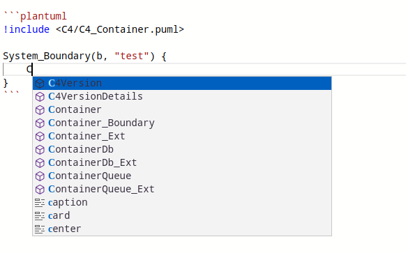

# ONote


## 特性

### 支持新窗口预览


### 支持打开不同数据源


### 双向编辑


### plantuml 智能提示



## 下载

[Release](https://github.com/pansinm/ONote/releases)

## Development

```bash
yarn watch
```

## Compile

```bash
# linux
yarn compile
# win
yarn compile:win
```

## 依赖于

1. 脚手架 [vite-electron-builder](https://github.com/cawa-93/vite-electron-builder)
2. 编辑器 [monaco-editor](https://microsoft.github.io/monaco-editor/)
3. [Markdown AST](https://github.com/syntax-tree/mdast)
4. Graphviz 渲染 [@hpcc-js/wasm](https://github.com/hpcc-systems/hpcc-js-wasm)

## License

[MIT](LICENSE)
