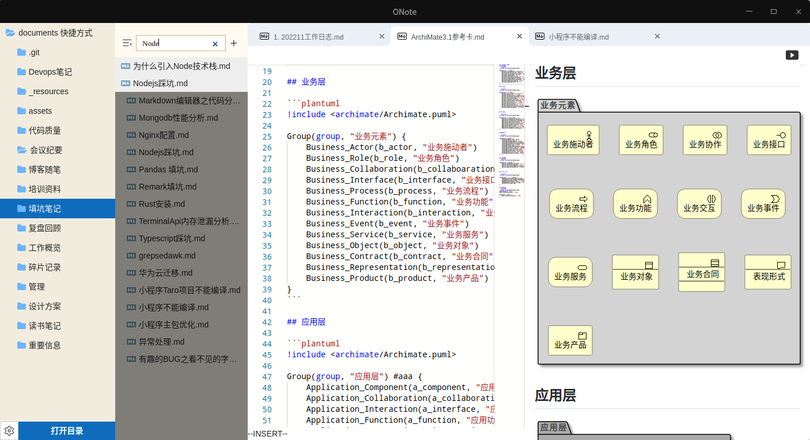

# ONote 

## 特性

详细特性参考[特性说明](docs/特性说明.md)

### v0.3.0
1. 支持新窗口打开预览页面
2. 支持粘贴图片
3. 支持自动保存文件
4. 支持拖拽外部文件到文件列表
5. 切换文件时保持文件的滚动条位置
6. 支持Ctrl+-/+缩放预览页面

### v0.2.0

1. 支持emoji star
2. 支持在windows打开ssh资源
3. 支持文件搜索
4. 美化滚动条样式

### v0.1.0
1. 支持打开本地目录
2. 支持打开远程目录(不稳定)
3. 支持有限的文件管理（打开、创建、拖拽、重命名及删除等）
4. 支持Markdown编辑及渲染
5. 支持多页签
6. 支持 Mermaid、Graphviz、PlantUML等图表渲染
7. 支持将渲染后的图片复制到剪切板
8. 支持将代码复制成图片
9. 支持表格和任务的双向编辑
10. 支持@快捷插入（只支持日期）

## 下载
[Release](https://github.com/pansinm/ONote/releases)

## 其他

1. 脚手架 [vite-electron-builder](https://github.com/cawa-93/vite-electron-builder)
2. 编辑器 [monaco-editor](https://microsoft.github.io/monaco-editor/)
3. [Markdown AST](https://github.com/syntax-tree/mdast)
4. Graphviz渲染 [@hpcc-js/wasm](https://github.com/hpcc-systems/hpcc-js-wasm)

## License

[MIT](LICENSE)

