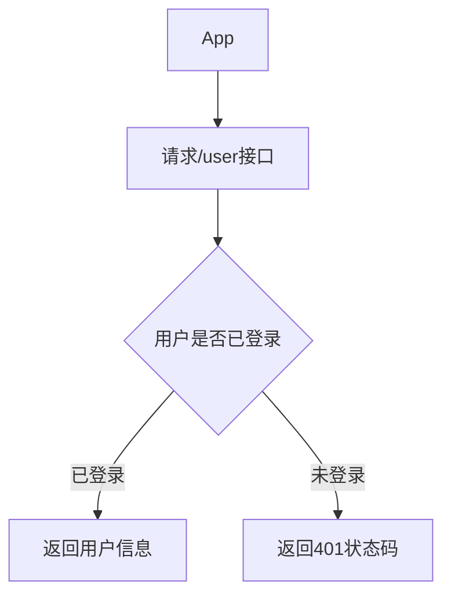

好的，以下是使用Mermaid绘制的流程图：

```mermaid
graph TD;
    A[App] --> B[请求/user接口];
    B --> C{用户是否已登录};
    C -- 已登录 --> D[返回用户信息];
    C -- 未登录 --> E[返回401状态码];
```

解释一下：

- App向服务端发送请求，请求的接口是`/user`。
- 服务端接收到请求后，判断用户是否已登录。
- 如果用户已登录，服务端返回用户信息。
- 如果用户未登录，服务端返回401状态码，表示未授权访问。

希望这个流程图能够帮到你！