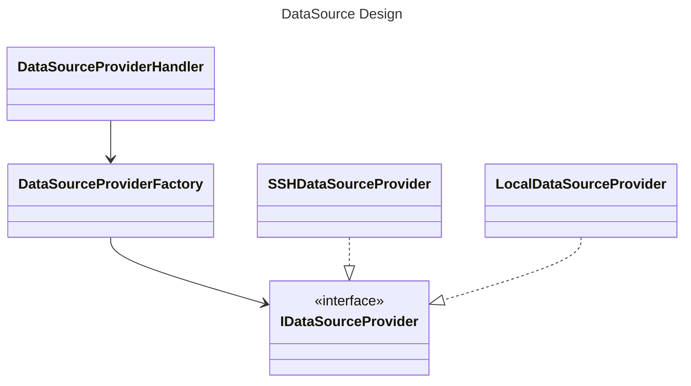

```mermaid
---
title: DataSource Design
---
classDiagram
    direction TB
    class IDataSourceProvider{
        <<interface>>
    }

    class SSHDataSourceProvider{
    }

    class SSHDataSourceProvider{
    }

    class DataSourceProviderFactory {
    }

    DataSourceProviderHandler --> DataSourceProviderFactory
    DataSourceProviderFactory --> IDataSourceProvider

    SSHDataSourceProvider ..|> IDataSourceProvider
    LocalDataSourceProvider ..|> IDataSourceProvider

```
