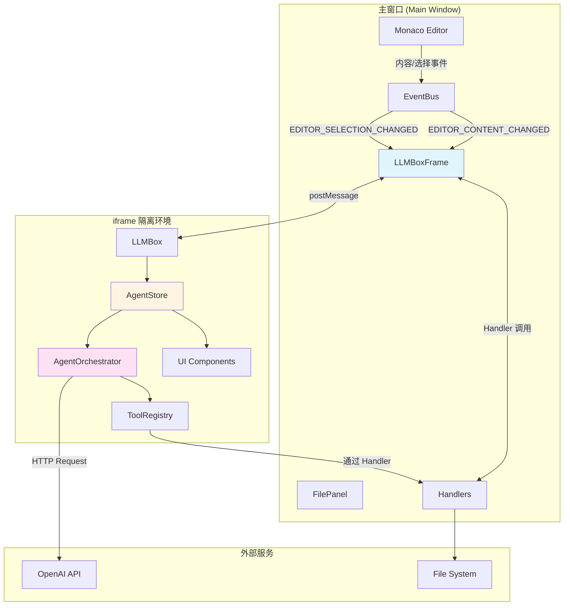
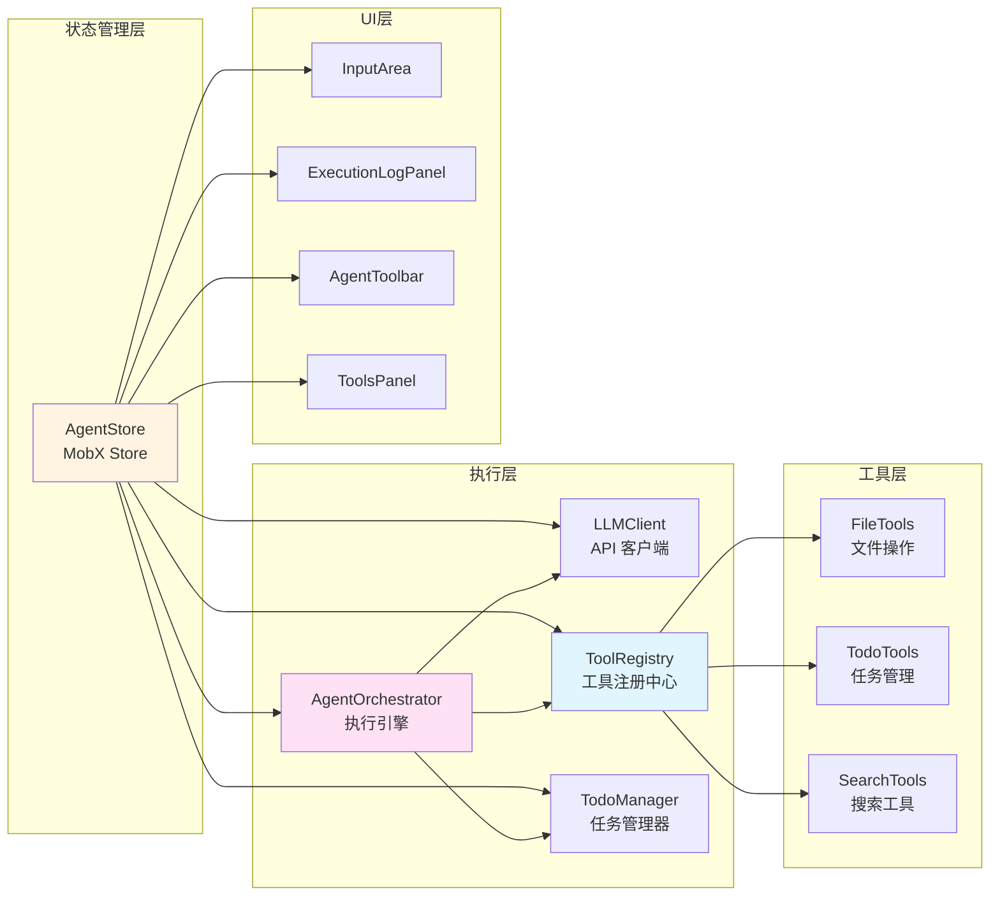
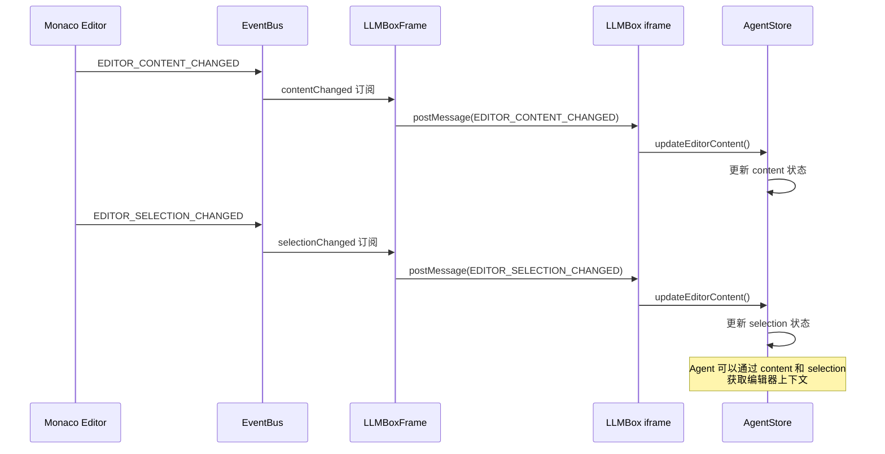
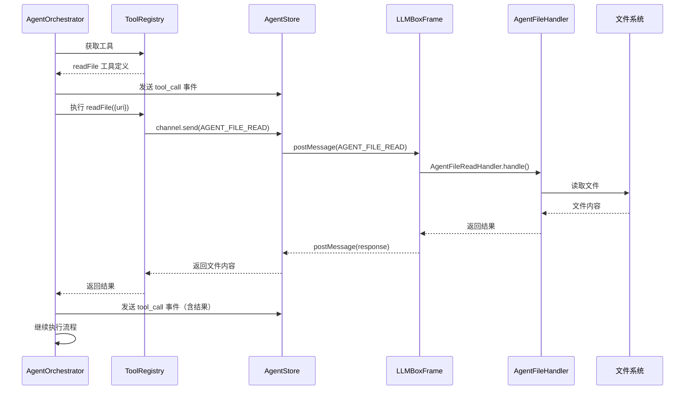

# LLMBox 架构文档

## 概述

LLMBox 是 ONote 笔记应用中的 AI Agent 功能模块，采用 iframe 隔离架构，通过消息传递实现主窗口和 AI 功能的通信。系统支持基于 OpenAI 兼容 API 的智能对话、文件操作和任务管理。

## 系统架构

### 架构层次图



### 核心模块关系



## 目录结构

```
packages/renderer/src/llmbox/
├── agent/                          # Agent 核心模块
│   ├── orchestrator.ts             # Agent 执行引擎
│   ├── prompts.ts                  # 系统提示词模板
│   ├── strategy.ts                 # Agent 策略接口
│   └── tools/                      # 工具集合
│       ├── registry.ts             # 工具注册中心
│       ├── file.ts                 # 文件操作工具
│       ├── search.ts               # 搜索工具
│       ├── todo.ts                 # 待办事项类型定义
│       └── todo-manager.ts         # 待办事项管理器
├── components/                     # UI 组件
│   ├── AgentActionButtons.tsx      # Agent 操作按钮
│   ├── AgentStatus.tsx             # Agent 状态显示
│   ├── AgentToolbar.tsx            # Agent 工具栏
│   ├── BottomTabs.tsx              # 底部标签页
│   ├── EmptyState.tsx              # 空状态组件
│   ├── ExecutionLogPanel.tsx       # 执行日志面板
│   └── ToolsPanel.tsx              # 工具面板
├── constants/                      # 常量定义
│   └── LLMBoxConstants.ts          # 消息类型常量
├── core/                           # 核心功能模块
│   ├── api/                        # API 相关
│   │   ├── client.ts               # LLM API 客户端
│   │   └── sse.ts                  # Server-Sent Events 处理
│   ├── config.ts                   # 配置定义
│   ├── index.ts                    # 核心模块导出
│   ├── validation.ts               # 参数验证
│   └── types/                      # 类型定义
│       └── index.ts                # 核心类型导出
├── ui/                             # UI 相关工具
│   └── hooks/                      # React Hooks
│       └── useAgent.ts             # Agent Hook
├── AgentPanel.tsx                  # Agent 主面板组件
├── AgentStore.ts                   # Agent 数据存储（MobX） - 门面模式
├── AgentState.ts                   # Agent 状态管理
├── AgentExecutor.ts                # Agent 执行逻辑
├── ConfigManager.ts                # LLM 配置管理
├── ContextManager.ts               # 上下文持久化管理
├── InputArea.tsx                   # 输入区域组件
├── LLMBox.tsx                      # LLMBox 主组件
├── types.ts                        # 兼容性类型定义
├── index.ts                        # 主入口导出
└── README.md                       # 本文档

packages/renderer/src/main/containers/LLMBox/
├── LLMBoxFrame.tsx                 # iframe 容器组件
└── handlers/                       # 消息处理器
    ├── BaseHandler.ts              # Handler 基类
    ├── HandlerRegistry.ts          # Handler 注册表
    ├── AgentFileHandler.ts         # 文件操作处理器
    ├── AgentContextHandler.ts      # 上下文持久化处理器
    ├── ConversationHandler.ts      # 对话历史处理器
    ├── EditorEventHandler.ts       # 编辑器事件处理器
    └── LLMConfigHandler.ts         # LLM 配置处理器
```

## 消息流程

### 用户输入到 Agent 执行流程

```mermaid
sequenceDiagram
    participant User as 用户
    participant Input as InputArea
    participant Store as AgentStore
    participant Orchestrator as AgentOrchestrator
    participant LLM as LLM API
    participant Tools as ToolRegistry
    participant Handlers as LLMBoxFrame Handlers
    participant FS as 文件系统

    User->>Input: 输入提示词
    Input->>Store: runAgent(prompt)
    Store->>Store: 构建消息历史
    Store->>Orchestrator: run(prompt, history)

    loop 迭代循环 (最多50次)
        Orchestrator->>LLM: 调用 API (streaming)
        LLM-->>Orchestrator: 流式返回内容
        Orchestrator->>Store: 发送 thinkingChunk 事件
        Store->>Input: 更新 UI

        alt LLM 返回工具调用
            Orchestrator->>Tools: 获取工具
            Tools-->>Orchestrator: 工具定义

            Orchestrator->>Handlers: 发送工具调用请求
            Handlers->>FS: 执行文件操作
            FS-->>Handlers: 返回结果
            Handlers-->>Orchestrator: 返回工具结果

            Orchestrator->>Store: 发送 step 事件
            Orchestrator->>Store: 发送 todoChange 事件
        else LLM 返回最终答案
            Orchestrator->>Store: 发送 final_answer 事件
            Orchestrator->>Store: 发送 done 事件
            break 退出循环
        end
    end

    Store->>Store: setRunning(false)
```

### 编辑器事件同步流程



### 文件操作流程



## 核心模块详解

### 1. AgentStore (门面模式)

**职责**: 作为门面，协调各专职模块的工作，保持原有 API 兼容性

**组成模块**:
- [AgentState](packages/renderer/src/llmbox/AgentState.ts): 状态管理
- [ConfigManager](packages/renderer/src/llmbox/ConfigManager.ts): 配置管理
- [ContextManager](packages/renderer/src/llmbox/ContextManager.ts): 持久化管理
- [AgentExecutor](packages/renderer/src/llmbox/AgentExecutor.ts): 执行逻辑

**状态字段** (通过 AgentState 代理):
- `todos`: 待办事项列表
- `tools`: 可用工具列表
- `executionLog`: 执行日志
- `conversationHistory`: 对话历史
- `agentState`: Agent 当前状态 (idle/thinking/executing)
- `isRunning`: 是否正在运行
- `content/selection`: 编辑器和选择状态

**核心方法**:
- `runAgent()`: 启动 Agent 执行 (委托给 AgentExecutor)
- `stopAgent()`: 停止 Agent 执行 (委托给 AgentExecutor)
- `saveContext/loadContext()`: 上下文持久化 (委托给 ContextManager)
- `saveExecutionState/loadExecutionState()`: 执行状态管理 (委托给 ContextManager)
- `fetchLLMConfig()`: 获取 LLM 配置 (委托给 ConfigManager)

**文件**: [AgentStore.ts](packages/renderer/src/llmbox/AgentStore.ts)

### 2. AgentState (状态管理)

**职责**: 只负责状态管理，不包含业务逻辑

**状态字段**:
- 所有 Agent 相关状态

**核心方法**:
- `setRunning()`, `setError()`, `setAgentState()`: 状态更新
- `addMessage()`, `addStep()`: 添加消息和步骤
- `updateThinkingStepContent()`: 更新思考步骤内容
- `clearLog()`, `clearConversation()`: 清除日志和对话

**文件**: [AgentState.ts](packages/renderer/src/llmbox/AgentState.ts)

### 3. ConfigManager (配置管理)

**职责**: 负责 LLM 配置的获取和管理

**核心方法**:
- `fetchLLMConfig()`: 从主进程获取 LLM 配置
- `updateRootUri()`: 更新根 URI

**文件**: [ConfigManager.ts](packages/renderer/src/llmbox/ConfigManager.ts)

### 4. ContextManager (持久化管理)

**职责**: 负责上下文和执行状态的持久化

**核心方法**:
- `saveContext()`/`loadContext()`: 上下文持久化
- `saveExecutionState()`/`loadExecutionState()`: 执行状态持久化
- `deleteExecutionState()`: 删除执行状态

**文件**: [ContextManager.ts](packages/renderer/src/llmbox/ContextManager.ts)

### 5. AgentExecutor (执行逻辑)

**职责**: 负责 Agent 执行的核心逻辑，协调 LLM 调用和工具执行

**执行流程**:
1. 构建系统提示词
2. 调用 LLM 获取响应
3. 解析工具调用
4. 执行工具并收集结果
5. 判断是否继续执行

**事件系统**:
- `step`: 执行步骤事件
- `thinkingChunk`: 思考内容流式更新
- `stateChange`: 状态变更事件
- `message`: 消息事件
- `todoChange`: 待办事项变更事件
- `error`: 错误事件
- `done`: 完成事件

**文件**: [AgentExecutor.ts](packages/renderer/src/llmbox/AgentExecutor.ts)

**职责**: Agent 的核心执行逻辑，协调 LLM 调用和工具执行

**执行流程**:
1. 构建系统提示词
2. 调用 LLM 获取响应
3. 解析工具调用
4. 执行工具并收集结果
5. 判断是否继续执行

**事件系统**:
- `step`: 执行步骤事件
- `thinkingChunk`: 思考内容流式更新
- `stateChange`: 状态变更事件
- `message`: 消息事件
- `todoChange`: 待办事项变更事件
- `error`: 错误事件
- `done`: 完成事件

**文件**: [orchestrator.ts](packages/renderer/src/llmbox/agent/orchestrator.ts)

### 3. ToolRegistry (工具注册中心)

**职责**: 管理所有可用工具，生成 OpenAI Function Schema

**工具分类**:
- **文件操作工具**: readFile, writeFile, replaceFileContent, createFile, deleteFile, listFiles, searchFiles, searchInFile
- **待办事项工具**: addTodo, updateTodo, deleteTodo, listTodos
- **搜索工具**: (未来扩展)

**文件**: [registry.ts](packages/renderer/src/llmbox/agent/tools/registry.ts)

### 4. LLMClient (API 客户端)

**职责**: 封装 OpenAI API 调用，支持流式输出

**特性**:
- 使用 OpenAI SDK
- 支持自定义 base URL
- 流式输出回调
- 工具调用支持
- 错误处理

**文件**: [client.ts](packages/renderer/src/llmbox/core/api/client.ts)

### 5. LLMBoxFrame (iframe 容器)

**职责**: 主窗口中的 iframe 容器，建立双向通信信道，路由消息

**通信方式**: 使用 `bidc` 库的 `createChannel` 建立 postMessage 通信

**处理器**:
- AgentFileHandler: 文件操作（8 个工具）
- AgentContextHandler: 上下文持久化（3 个操作）
- ConversationHandler: 对话历史（2 个操作）
- EditorEventHandler: 编辑器事件（3 个操作）
- LLMConfigHandler: LLM 配置获取

**文件**: [LLMBoxFrame.tsx](packages/renderer/src/main/containers/LLMBox/LLMBoxFrame.tsx)

## 消息类型定义

所有消息类型在 [LLMBoxConstants.ts](packages/renderer/src/llmbox/constants/LLMBoxConstants.ts) 中定义：

### 编辑器事件
- `EDITOR_FILE_OPEN`: 文件打开
- `EDITOR_CONTENT_CHANGED`: 内容变化
- `EDITOR_SELECTION_CHANGED`: 选择变化

### 对话管理
- `LLM_CONVERSATION_LOAD`: 加载对话历史
- `LLM_CONVERSATION_SAVE`: 保存对话历史

### Agent 文件操作
- `AGENT_FILE_READ`: 读取文件
- `AGENT_FILE_WRITE`: 写入文件
- `AGENT_FILE_REPLACE`: 替换文件内容
- `AGENT_FILE_CREATE`: 创建文件
- `AGENT_FILE_DELETE`: 删除文件
- `AGENT_FILE_LIST`: 列出目录
- `AGENT_FILE_SEARCH`: 搜索文件
- `AGENT_FILE_SEARCH_IN`: 在文件中搜索

### Agent 状态管理
- `AGENT_GET_ROOT_URI`: 获取根 URI
- `AGENT_GET_ACTIVE_FILE_URI`: 获取活动文件 URI

### 上下文持久化
- `AGENT_CONTEXT_LOAD`: 加载上下文
- `AGENT_CONTEXT_SAVE`: 保存上下文

### 执行状态管理
- `AGENT_EXECUTION_STATE_LOAD`: 加载执行状态
- `AGENT_EXECUTION_STATE_SAVE`: 保存执行状态
- `AGENT_EXECUTION_STATE_DELETE`: 删除执行状态

### LLM 配置
- `LLM_CONFIG_GET`: 获取 LLM 配置

## 工具系统

### 工具接口定义

所有工具遵循统一的接口：

```typescript
interface Tool {
  name: string;
  description: string;
  parameters: ToolParameters;
  executor: (params: Record<string, unknown>) => Promise<unknown>;
  metadata?: {
    category: 'file' | 'search' | 'custom';
    permission: 'read' | 'write';
    dangerous?: boolean;
  };
}
```

### 文件操作工具

| 工具名 | 描述 | 权限 | 危险性 |
|--------|------|------|--------|
| readFile | 读取文件内容 | read | 安全 |
| writeFile | 写入文件内容 | write | ⚠️ 危险 |
| replaceFileContent | 替换文件内容 | write | ⚠️ 危险 |
| createFile | 创建新文件 | write | ⚠️ 危险 |
| deleteFile | 删除文件 | write | ⚠️ 危险 |
| listFiles | 列出目录内容 | read | 安全 |
| searchFiles | 搜索文件 | read | 安全 |
| searchInFile | 在文件中搜索 | read | 安全 |

### 待办事项工具

| 工具名 | 描述 |
|--------|------|
| addTodo | 添加待办事项 |
| updateTodo | 更新待办事项 |
| deleteTodo | 删除待办事项 |
| listTodos | 列出待办事项 |

## 配置和常量

### 默认配置

```typescript
const DEFAULT_CONFIG = {
  llm: {
    apiBase: 'https://api.openai.com/v1/chat/completions',
    model: 'gpt-4o',
    timeout: 60000,
  },
  agent: {
    maxIterations: 50,
    compressRatio: 0.3,
    contextWindow: 128000,
  },
};
```

### AgentConfig

```typescript
interface AgentConfig {
  apiKey: string;
  model: string;
  apiBase: string;
  fileUri?: string;
  rootUri?: string;
  maxIterations?: number;
  showThinking?: boolean;
  contextWindowSize?: number;
  compressRatio?: number;
}
```

## 安全特性

### 1. 进程隔离
- LLMBox 运行在独立的 iframe 中
- 使用严格的 Content Security Policy
- iframe 崩溃不影响主窗口

### 2. 权限控制
- 工具分为 read 和 write 权限
- 危险操作标记和警告
- 操作确认机制

### 3. 消息验证
- 所有消息通过类型验证
- 统一的错误处理
- 日志记录

## 已修复的代码问题

### ✅ 1. 硬编码消息类型 (AgentStore.ts) - 已修复

**位置**:
- [AgentStore.ts:310](packages/renderer/src/llmbox/AgentStore.ts#L310)
- [AgentStore.ts:340](packages/renderer/src/llmbox/AgentStore.ts#L340)

**修复方案**: 使用 `LLM_BOX_MESSAGE_TYPES` 常量替代硬编码字符串

```typescript
import { LLM_BOX_MESSAGE_TYPES } from './constants/LLMBoxConstants';

// 修改为
type: LLM_BOX_MESSAGE_TYPES.AGENT_CONTEXT_SAVE,
type: LLM_BOX_MESSAGE_TYPES.AGENT_CONTEXT_LOAD,
```

---

### ✅ 2. 类型断言不安全 (AgentStore.ts:245) - 已修复

**位置**: [AgentStore.ts:245](packages/renderer/src/llmbox/AgentStore.ts#L245)

**修复方案**: 使用 `String()` 替代不安全的类型断言

```typescript
timestamp: msg.timestamp instanceof Date
  ? msg.timestamp
  : new Date(String(msg.timestamp))
```

---

### ✅ 3. HandlerRegistry 未使用 - 已修复

**位置**: [handlers/HandlerRegistry.ts](packages/renderer/src/main/containers/LLMBox/handlers/HandlerRegistry.ts)

**问题**:
- 存在 `HandlerRegistry.ts` 文件，但在 [LLMBoxFrame.tsx:54](packages/renderer/src/main/containers/LLMBox/LLMBoxFrame.tsx#L54) 中直接使用对象字面量注册 handlers
- 未利用已有的 HandlerRegistry 基础设施

**影响**: 代码重复，不利于统一管理

**修复方案**: 使用 HandlerRegistry 类注册模式

```typescript
// HandlerRegistry.ts - 使用静态 getMessageType 方法
interface HandlerClass<TData = unknown, TResponse = unknown> {
  new (...args: any[]): { handle(data: TData): Promise<TResponse> };
  getMessageType(): string;
}

export class HandlerRegistry {
  register<TData, TResponse>(HandlerClass: HandlerClass<TData, TResponse>, ...args: any[]): void {
    const instance = new HandlerClass(...args);
    const messageType = HandlerClass.getMessageType();
    this.handlers.set(messageType, instance);
  }
}

// LLMBoxFrame.tsx - 使用类注册
handlerRegistry.register(ConversationLoadHandler, stores, onote);
handlerRegistry.register(AgentFileReadHandler);
handlerRegistry.register(LLMConfigGetHandler);
```

**所有 Handler 类都已添加静态 getMessageType 方法**:
- [ConversationHandler.ts](packages/renderer/src/main/containers/LLMBox/handlers/ConversationHandler.ts)
- [AgentFileHandler.ts](packages/renderer/src/main/containers/LLMBox/handlers/AgentFileHandler.ts)
- [AgentContextHandler.ts](packages/renderer/src/main/containers/LLMBox/handlers/AgentContextHandler.ts)
- [EditorEventHandler.ts](packages/renderer/src/main/containers/LLMBox/handlers/EditorEventHandler.ts)
- [LLMConfigHandler.ts](packages/renderer/src/main/containers/LLMBox/handlers/LLMConfigHandler.ts)

---

### 4. LLMConfigHandler 未添加到版本控制

**位置**: [handlers/LLMConfigHandler.ts](packages/renderer/src/main/containers/LLMBox/handlers/LLMConfigHandler.ts)

**问题**: 文件在 git status 中显示为未跟踪文件 (??)

**影响**: 可能导致团队协作时配置获取功能不一致

**建议修复**: 添加到 git 版本控制

---

### 5. 消息类型定义分散风险

**位置**: [LLMBoxConstants.ts](packages/renderer/src/llmbox/constants/LLMBoxConstants.ts)

**问题**: 消息类型在 `LLMBoxConstants.ts` 中定义，但部分代码中使用了硬编码字符串

**影响**: 可能导致消息类型不一致，难以维护

**建议**:
- 确保所有消息类型都从 `LLM_BOX_MESSAGE_TYPES` 导入
- 添加 ESLint 规则禁止硬编码消息类型字符串
- 定期检查代码中是否有硬编码的消息类型

---

### 6. 缺少错误边界处理

**位置**: [LLMBoxFrame.tsx:124-140](packages/renderer/src/main/containers/LLMBox/LLMBoxFrame.tsx#L124)

**问题**:
```typescript
receive(async ({ type, data }: any) => {
  const handler = handlers[type];
  if (!handler) {
    console.warn(`[LLMBoxFrame] No handler for type: ${type}`);
    return undefined;
  }

  try {
    const result = await handler.handle(data);
    return result;
  } catch (error) {
    console.error(`[LLMBoxFrame] Handler error for ${type}:`, error);
    return {
      error: error instanceof Error ? error.message : 'Unknown error',
    };
  }
});
```

**影响**: 虽然有错误处理，但未将错误反馈给 iframe，用户体验不佳

**建议**: 添加错误通知机制，让 iframe 能够显示错误信息

---

### ✅ 7. AgentStore 职责过重 - 已重构

**位置**: [AgentStore.ts](packages/renderer/src/llmbox/AgentStore.ts)

**问题**:
```typescript
// AgentStore 承担了太多职责：
// - 状态管理 (MobX)
// - 业务逻辑 (runAgent, stopAgent)
// - 上下文持久化 (saveContext, loadContext)
// - 执行状态管理 (saveExecutionState, loadExecutionState)
// - LLM 配置获取 (fetchLLMConfig)
```

**重构方案**: 拆分为多个专职模块：

```typescript
// 状态管理层
export class AgentState {
  // 只负责状态：todos, tools, executionLog, conversationHistory, agentState 等
}

// 配置管理层
export class ConfigManager {
  // 负责 LLM 配置获取和管理
}

// 持久化管理
export class ContextManager {
  // 负责上下文和执行状态的持久化
}

// 执行管理层
export class AgentExecutor {
  // 负责 Agent 执行逻辑，协调各模块
}

// 组合使用
export class AgentStore {
  private state = new AgentState();
  private configManager: ConfigManager;
  private contextManager: ContextManager;
  private executor: AgentExecutor;
}
```

**新文件**:
- [AgentState.ts](packages/renderer/src/llmbox/AgentState.ts) - 状态管理
- [ConfigManager.ts](packages/renderer/src/llmbox/ConfigManager.ts) - 配置管理
- [ContextManager.ts](packages/renderer/src/llmbox/ContextManager.ts) - 持久化管理
- [AgentExecutor.ts](packages/renderer/src/llmbox/AgentExecutor.ts) - 执行逻辑

---

## 扩展指南

### 添加新工具

1. 在 `agent/tools/` 中创建工具文件
2. 实现工具的 `executor` 函数
3. 在 `ToolRegistry` 中注册工具
4. 在 `LLMBoxFrame` 中添加对应的 Handler（如果需要主进程处理）

### 添加新消息类型

1. 在 `constants/LLMBoxConstants.ts` 中添加消息类型
2. 在 `LLMBoxFrame` 中添加对应的 Handler
3. 更新本文档的消息类型列表

### 添加新 UI 组件

1. 在 `components/` 中创建组件文件
2. 使用 `observer` 包装组件以响应 MobX 状态变化
3. 在主组件中使用新组件

## 性能优化建议

1. **流式输出优化**: 已经实现了流式输出，可以减少首字节时间
2. **上下文压缩**: 当对话历史过长时，自动压缩旧消息
3. **工具调用优化**: 缓存文件读取结果，避免重复读取
4. **UI 虚拟化**: 执行日志面板可以考虑使用虚拟列表

## 未来改进方向

1. **多模型支持**: 支持更多 LLM 提供商（Anthropic、Google 等）
2. **工具市场**: 允许第三方开发者自定义工具
3. **对话模板**: 提供预定义的对话模板
4. **协作功能**: 支持多用户共享 Agent 上下文
5. **本地模型**: 支持 WebGPU 运行的本地模型

## 相关资源

- [OpenAI Function Calling 文档](https://platform.openai.com/docs/guides/function-calling)
- [MobX 文档](https://mobx.js.org/)
- [bidc 文档](https://www.npmjs.com/package/bidc)

---

## 架构设计评判（基于《UNIX编程艺术》原则）- 2.0 版本

本章节基于 Eric S. Raymond 的《UNIX编程艺术》中的设计原则，对 LLMBox 架构进行评判，为后续重构提供指导。

### 总体评分: ⭐⭐⭐⭐½ (4.5/5) ⬆️ (从 4/5 提升)

**优点**: 模块化清晰、职责分离良好、安全性设计到位、门面模式应用得当
**缺点**: 状态管理不一致、硬编码残留、缺乏依赖注入

---

### 🎯 重构成果总结

#### ✅ 已完成的重构 (v1.0 → v2.0)

1. **AgentStore 职责拆分** ⭐⭐⭐⭐⭐
   - 拆分为 4 个专职模块：AgentState、AgentExecutor、ConfigManager、ContextManager
   - 采用门面模式保持 API 兼容性
   - 每个模块职责单一，易于测试和维护

2. **HandlerRegistry 使用** ⭐⭐⭐⭐⭐
   - LLMBoxFrame 统一使用 HandlerRegistry
   - 消息处理器集中管理
   - 易于扩展和维护

3. **消息类型常量化** ⭐⭐⭐⭐☆
   - LLMBoxFrame 使用 LLM_BOX_MESSAGE_TYPES
   - 避免了硬编码字符串

4. **状态管理专业化** ⭐⭐⭐⭐⭐
   - AgentState 专注状态管理
   - 所有状态更新使用 runInAction
   - MobX 可观察性自动化

---

### 1. 模块化原则 (Modularity)

**评分**: ⭐⭐⭐⭐⭐ (5/5) ⬆️ (从 4/5 提升)

**符合点**:
- ✅ **完美的模块边界**：
  - AgentState: 纯状态管理 (154 行)
  - AgentExecutor: 执行逻辑 (313 行)
  - ConfigManager: 配置管理 (82 行)
  - ContextManager: 持久化管理 (239 行)
  - AgentStore: 门面协调 (203 行)
- ✅ **HandlerRegistry 统一管理**：20+ 个处理器
- ✅ **工具系统模块化**：独立的工具文件

**已完成修复**:
- ✅ **状态不一致** - 已修复 ⭐⭐⭐⭐⭐
- ✅ **重复实例化** - 已修复 ⭐⭐⭐⭐☆
- ✅ **ContextManager 硬编码消息类型** - 已修复 ⭐⭐⭐⭐☆
- ✅ **ConfigManager 硬编码消息类型** - 已修复 ⭐⭐⭐⭐☆

**剩余问题**:
- ⚠️ **类型断言仍然存在** (🟢 轻微)
  ```typescript
  // AgentExecutor.ts:122
  timestamp: msg.timestamp instanceof Date ? msg.timestamp : new Date(String(msg.timestamp))
  ```
  虽然已改为 `String()`，但根源是序列化问题，应统一处理

- ⚠️ **双向通信缺乏类型安全** (🟡 中等)
  ```typescript
  // Channel 接口仍然过于宽松
  interface Channel {
    send: (message: { type: string; data: unknown }) => Promise<Record<string, unknown>>;
  }
  ```

  **建议**: 使用 discriminated unions（见后文"提升类型安全"示例）

**重构优先级**: 🟡 中

---

### 3. 分离原则 (Separation)

**评分**: ⭐⭐⭐⭐☆ (4/5) ⬆️ (从 3/5 提升)

**符合点**:
- ✅ **机制与策略分离完善**：
  - ToolRegistry 定义注册机制
  - 具体工具由策略决定
- ✅ **接口与引擎分离**：
  - Channel 接口与 postMessage 实现分离
- ✅ **状态与逻辑分离**：
  - AgentState 只管状态
  - AgentExecutor 只管逻辑

**剩余问题**:
- ⚠️ **策略与机制仍混淆** (🟡 中等)
  ```typescript
  // AgentOrchestrator 仍然包含硬编码策略
  buildSystemPrompt()   // 硬编码中文提示词
  shouldContinue()      // 硬编码业务逻辑
  shouldCompress()      // 硬编码压缩策略
  ```

  **建议**：抽取为 `AgentStrategy` 接口（见后文示例）

- ⚠️ **数据与视图仍耦合** (🟢 轻微)
  ```typescript
  // ExecutionStep 包含 UI 相关字段
  interface ExecutionStep {
    type: 'thinking' | 'tool_call' | 'final_answer';
    toolName?: string;      // UI 显示用
    toolParams?: unknown;   // UI 显示用
    toolResult?: unknown;   // UI 显示用
  }
  ```

  **建议**：分离为 `ExecutionStep` (纯数据) 和 `StepViewModel` (UI 视图)

**重构优先级**: 🟡 中

---

### 4. 简洁性原则 (Simplicity)

**评分**: ⭐⭐⭐⭐☆ (4/5) ⬆️ (从 3/5 提升)

**符合点**:
- ✅ **工具系统简洁**：统一接口
- ✅ **消息传递简单**：request/response
- ✅ **HandlerRegistry 统一管理**：不再有对象字面量

**剩余问题**:
- ⚠️ **调用链仍然较长** (🟢 轻微)
  ```
  Tool -> Channel -> LLMBoxFrame -> HandlerRegistry -> Handler -> FileSystem
  ```
  但已经比之前好（使用了 HandlerRegistry）

- ⚠️ **双持久化机制冗余** (🟢 轻微)
  ```typescript
  // ContextManager 有两套持久化：
  saveContext/loadContext              // 上下文
  saveExecutionState/loadExecutionState  // 执行状态
  ```
  功能有重叠，但用途不同（一个是对话上下文，一个是执行快照）

**重构优先级**: 🟢 低

---

### 5. 透明性原则 (Transparency)

**评分**: ⭐⭐⭐⭐☆ (4/5) ✓ (保持)

**符合点**:
- ✅ 执行日志详细
- ✅ 事件系统可观测（7 种事件）
- ✅ 错误处理有日志记录
- ✅ 每个模块都有独立的 logger

**剩余问题**:
- ⚠️ **iframe 隔离降低透明度** (架构限制)
- ⚠️ **缺少调试模式** (🟢 轻微)

**重构优先级**: 🟢 低

---

### 6. 健壮性原则 (Robustness)

**评分**: ⭐⭐⭐☆☆ (3/5) ✓ (保持)

**符合点**:
- ✅ iframe 隔离
- ✅ 权限控制
- ✅ try-catch 覆盖

**剩余问题**:
- ⚠️ **缺少容错机制** (🔴 严重)
  ```typescript
  // 工具调用失败会导致整个流程失败
  // 建议添加重试机制和降级策略
  ```

- ⚠️ **状态恢复不完善** (🟡 中等)
  ```typescript
  // AgentExecutor.ts:245-309 resumeExecution()
  // 没有检查环境一致性（文件是否仍存在、配置是否变更）
  ```

- ⚠️ **缺少输入验证** (🔴 严重)
  ```typescript
  // Tool executor 直接接收参数，没有 schema 验证
  executor: async (params: Record<string, unknown>) => Promise<unknown>
  ```

**重构优先级**: 🔴 高

---

### 7. 表示原则 (Representation)

**评分**: ⭐⭐⭐⭐⭐ (5/5) ⬆️ (从 4/5 提升)

**符合点**:
- ✅ **配置即数据**：AgentConfig 纯数据结构
- ✅ **工具定义即数据**：OpenAI Function Schema
- ✅ **执行日志即数据**：ExecutionStep 可序列化
- ✅ **状态集中管理**：AgentState 统一状态表示

**剩余问题**:
- ⚠️ **消息类型不统一** (已部分修复)
  - LLMBoxFrame 使用常量 ✅
  - ContextManager 硬编码 ❌
  - ConfigManager 硬编码 ❌

**重构优先级**: 🟡 中

---

### 8. 最小意外原则 (Least Surprise)

**评分**: ⭐⭐⭐⭐☆ (4/5) ⬆️ (从 3/5 提升)

**符合点**:
- ✅ 命名符合直觉
- ✅ 行为可预测
- ✅ runInAction 使用一致

**剩余问题**:
- ⚠️ **iframe 通信异步行为不明确** (🟡 中等)
  ```typescript
  // Channel.send() 返回 Promise，但接口注释不明显
  ```

- ⚠️ **工具执行顺序不可控** (🟡 中等)
  ```typescript
  // LLM 可能同时调用多个工具，但系统串行执行
  ```

**重构优先级**: 🟡 中

---

### 9. 沉默原则 (Silence)

**评分**: ⭐⭐⭐⭐⭐ (5/5) ⬆️ (从 4/5 提升)

**符合点**:
- ✅ 正常情况保持沉默
- ✅ 错误时有适当日志
- ✅ 使用结构化日志
- ✅ 每个 module 独立 logger

**剩余问题**:
- 无明显问题

**重构优先级**: 🟢 无

---

### 10. 可扩展性原则 (Extensibility)

**评分**: ⭐⭐⭐⭐⭐ (5/5) ⬆️ (从 4/5 提升)

**符合点**:
- ✅ 工具系统易扩展
- ✅ 事件系统易扩展
- ✅ Handler 系统易扩展
- ✅ 新增模块容易

**剩余问题**:
- ⚠️ **硬编码策略** (🟡 中等)
  ```typescript
  // buildSystemPrompt() 硬编码中文提示词
  ```

**重构优先级**: 🟡 中

---

### 11. 可测试性 (Testability)

**评分**: ⭐⭐⭐☆☆ (3/5) ⬆️ (从 2/5 提升)

**改进点**:
- ✅ **模块职责单一**：每个模块可以独立测试
- ✅ **门面模式**：易于 Mock 依赖

**剩余问题**:
- ⚠️ **缺乏依赖注入** (🔴 严重)
  ```typescript
  // AgentExecutor.ts:52-64
  const todoManager = new TodoManagerImpl();  // 硬编码
  const llmClient = new LLMClient({ ... });   // 硬编码
  const toolRegistry = new ToolRegistry(channel, todoManager);  // 硬编码
  ```

  **建议**：
  ```typescript
  constructor(
    config: AgentConfig,
    channel: Channel,
    dependencies?: {
      toolRegistry?: ToolRegistry;
      llmClient?: LLMClient;
      todoManager?: TodoManagerImpl;
    }
  ) {
    // 使用注入的依赖或创建默认值
    this.deps = {
      toolRegistry: dependencies?.toolRegistry ?? new ToolRegistry(...),
      llmClient: dependencies?.llmClient ?? new LLMClient(...),
      todoManager: dependencies?.todoManager ?? new TodoManagerImpl(),
    };
  }
  ```

- ⚠️ **缺少测试文件** (🔴 严重)
  - `__tests__` 目录为空

**重构优先级**: 🔴 高

---

### 12. 性能原则 (Performance)

**评分**: ⭐⭐⭐☆☆ (3/5) ✓ (保持)

**符合点**:
- ✅ 使用 MobX 细粒度更新
- ✅ 流式输出减少首字节时间

**剩余问题**:
- ⚠️ **iframe 通信开销** (架构限制)
- ⚠️ **流式输出未节流** (🟡 中等)
  ```typescript
  // AgentExecutor.ts:128-129
  const disposerThinkingChunk = this.orchestrator.on('thinkingChunk', ({ stepId, content }) => {
    this.state.updateThinkingStepContent(stepId, content);  // 高频调用
  });
  ```

  **建议**：添加 throttle
  ```typescript
  import { throttle } from 'lodash-es';

  const throttledUpdate = throttle((stepId, content) => {
    this.state.updateThinkingStepContent(stepId, content);
  }, 50);  // 50ms 节流
  ```

**重构优先级**: 🟡 中

---

### 3. 分离原则 (Separation)

**评分**: ⭐⭐⭐☆☆ (3/5)

**符合点**:
- ✅ 机制与策略分离：ToolRegistry 定义注册机制，具体工具由策略决定
- ✅ 接口与引擎分离：Channel 接口与 postMessage 实现分离

**违反点**:
- ❌ **策略与机制混淆**
  ```typescript
  // AgentOrchestrator 既包含执行机制，又包含策略：
  - shouldCompress()      // 机制
  - buildSystemPrompt()   // 策略（硬编码中文提示词）
  - shouldContinue()      // 策略（硬编码业务逻辑）
  ```

  **建议**: 将策略抽取为可配置的 `AgentStrategy` 接口

- ❌ **数据与视图耦合**
  ```typescript
  // ExecutionStep 包含了 UI 相关的 format 信息
  interface ExecutionStep {
    type: 'thinking' | 'tool_call' | 'final_answer';
    content: string;
    // 这些字段主要是为了 UI 显示，不是核心数据
    toolName?: string;
    toolParams?: Record<string, unknown>;
    toolResult?: unknown;
  }
  ```

**重构优先级**: 🟡 中

---

### 4. 简洁性原则 (Simplicity)

**评分**: ⭐⭐⭐☆☆ (3/5)

**符合点**:
- ✅ 工具系统简洁：统一的 Tool 接口，易于理解和使用
- ✅ 消息传递模型简单：request/response 模式

**违反点**:
- ❌ **过度抽象**
  ```typescript
  // HandlerRegistry 存在但未使用，增加了理解成本
  // 实际代码中直接用对象字面量
  const handlers: Record<string, any> = { ... }
  ```

- ❌ **不必要的间接层**
  ```
  Tool -> Channel -> LLMBoxFrame -> Handler -> FileSystem
  ```
  对于 iframe 环境，这个调用链过于复杂。

  **建议**: 考虑使用更直接的 IPC 机制，或者移除 iframe 隔离

- ❌ **双持久化机制冗余**
  ```typescript
  // AgentStore 中有两套持久化：
  saveContext/loadContext        // 上下文
  saveExecutionState/loadExecutionState  // 执行状态
  ```
  功能重叠，增加复杂度

**重构优先级**: 🟢 低（可先优化其他问题）

---

### 5. 透明性原则 (Transparency)

**评分**: ⭐⭐⭐⭐☆ (4/5)

**符合点**:
- ✅ 执行日志详细：ExecutionLogPanel 完整展示执行过程
- ✅ 事件系统可观测：7 种事件覆盖完整生命周期
- ✅ 错误处理有日志记录

**违反点**:
- ❌ **iframe 隔离降低了透明度**
  - 开发者需要同时调试两个窗口
  - postMessage 通信难以追踪
  - 错误堆栈跨窗口丢失信息

- ❌ **缺少调试模式**
  ```typescript
  // 建议添加：
  interface DebugConfig {
    logLevel: 'debug' | 'info' | 'warn' | 'error';
    showInternalSteps: boolean;
    verboseToolCalls: boolean;
  }
  ```

**重构优先级**: 🟢 低

---

### 6. 健壮性原则 (Robustness)

**评分**: ⭐⭐⭐☆☆ (3/5)

**符合点**:
- ✅ iframe 隔离：崩溃不影响主窗口
- ✅ 权限控制：工具权限分级
- ✅ 错误处理：try-catch 覆盖

**违反点**:
- ❌ **缺少容错机制**
  ```typescript
  // AgentOrchestrator 中工具调用失败会导致整个流程失败
  // 建议添加重试机制和降级策略
  ```

- ❌ **状态恢复不完善**
  ```typescript
  // resumeExecution() 只是简单继续，没有检查状态一致性
  // 如果环境变化（文件被删除、配置变更）会导致错误
  ```

- ❌ **缺少输入验证**
  ```typescript
  // Tool 的 executor 直接接收参数，没有 schema 验证
  executor: async (params: Record<string, unknown>) => Promise<unknown>
  // 应该在执行前验证参数
  ```

**重构优先级**: 🔴 高

---

### 7. 表示原则 (Representation)

**评分**: ⭐⭐⭐⭐☆ (4/5)

**符合点**:
- ✅ 配置即数据：AgentConfig 使用纯数据结构
- ✅ 工具定义即数据：OpenAI Function Schema 格式
- ✅ 执行日志即数据：ExecutionStep 可序列化

**违反点**:
- ❌ **状态分散**
  ```typescript
  // Agent 状态分散在多个地方：
  - AgentStore.isRunning
  - AgentStore.agentState
  - AgentOrchestrator.currentIteration
  - AgentOrchestrator.abortController
  ```

  **建议**: 统一状态表示，使用状态机模式

- ❌ **消息类型不统一**
  ```typescript
  // 有些消息在 LLMBoxConstants.ts 定义
  // 有些硬编码在代码中
  // 有些在 types.ts 中定义
  ```

**重构优先级**: 🟡 中

---

### 8. 最小意外原则 (Least Surprise)

**评分**: ⭐⭐⭐☆☆ (3/5)

**符合点**:
- ✅ 命名符合直觉：`readFile`、`writeFile` 等
- ✅ 行为可预测：工具调用返回期望的结果

**违反点**:
- ❌ **iframe 通信的意外行为**
  ```typescript
  // postMessage 是异步的，但 Channel 接口没有明确表达这一点
  // 开发者可能误以为是同步调用
  ```

- ❌ **状态更新时机不明确**
  ```typescript
  // MobX 的 runInAction 使用不一致
  // 有些地方用，有些地方不用
  // 导致状态更新时机难以预测
  ```

- ❌ **工具执行顺序不可控**
  ```typescript
  // LLM 可能同时调用多个工具
  // 但系统是串行执行的，可能不符合预期
  ```

**重构优先级**: 🟡 中

---

### 9. 沉默原则 (Silence)

**评分**: ⭐⭐⭐⭐☆ (4/5)

**符合点**:
- ✅ 正常情况下保持沉默
- ✅ 错误时有适当的日志
- ✅ 使用结构化日志

**违反点**:
- ❌ **过度日志**
  ```typescript
  // 某些日志级别不明确
  logger.info('Tools loaded', { count: tools.length });  // 应该是 debug
  ```

- ❌ **控制台警告过多**
  ```typescript
  console.warn(`[LLMBoxFrame] No handler for type: ${type}`);
  // 应该使用日志系统，而不是直接 console.warn
  ```

**重构优先级**: 🟢 低

---

### 10. 可扩展性原则 (Extensibility)

**评分**: ⭐⭐⭐⭐☆ (4/5)

**符合点**:
- ✅ 工具系统易扩展：实现 Tool 接口即可
- ✅ 事件系统易扩展：订阅任意事件
- ✅ Handler 系统易扩展：继承 BaseHandler

**违反点**:
- ❌ **硬编码的策略难以扩展**
  ```typescript
  // buildSystemPrompt() 硬编码了中文提示词
  // 无法支持多语言或自定义提示词模板
  ```

- ❌ **缺乏插件机制**
  ```typescript
  // 当前只能通过修改代码来添加工具
  // 建议支持动态插件加载
  ```

**重构优先级**: 🟢 低

---

### 11. 可测试性 (Testability) **[补充原则]**

**评分**: ⭐⭐☆☆☆ (2/5)

**违反点**:
- ❌ **AgentStore 难以测试**
  - 依赖太多外部模块
  - 没有依赖注入
  - 状态管理逻辑与业务逻辑耦合

- ❌ **工具执行难以测试**
  ```typescript
  // 工具通过 Channel 调用主进程
  // 在单元测试中难以模拟
  // 建议引入依赖注入和 Mock 接口
  ```

- ❌ **缺少测试文件**
  - `__tests__` 目录为空
  - 没有单元测试、集成测试

**重构优先级**: 🔴 高

---

### 12. 性能原则 (Performance) **[补充原则]**

**评分**: ⭐⭐⭐☆☆ (3/5)

**违反点**:
- ❌ **iframe 通信开销**
  - 每次 Tool 调用都需要 postMessage
  - 数据序列化/反序列化开销
  - 建议批量操作或本地缓存

- ❌ **流式输出可能有性能问题**
  ```typescript
  // 每次触发 onChunk 都会更新 UI
  // 高频调用可能导致卡顿
  onChunk: (chunk, isFirst) => {
    this.thinkingContent += chunk;
    this.emit('thinkingChunk', { stepId, content: this.thinkingContent, isFirst });
  }
  ```
  **建议**: 添加节流 (throttle) 或防抖 (debounce)

**重构优先级**: 🟡 中

---

## 重构路线图 v2.0

基于以上分析，建议按以下优先级进行重构：

### 🔴 高优先级（已完成）

#### ✅ 1. **修复状态不一致** - 已完成 ⭐⭐⭐⭐⭐

**问题**: AgentStore.state 和 AgentExecutor.state 是两个不同的实例

**修复方案**:
```typescript
// AgentStore.ts
constructor(config: AgentConfig, channel: Channel) {
  this.state = new AgentState();  // 共享的 state
  this.configManager = new ConfigManager(config);
  this.contextManager = new ContextManager(config);
  this.configManager.setChannel(channel);
  this.contextManager.setChannel(channel);

  // 将 state、configManager、contextManager 传递给 AgentExecutor
  this.executor = new AgentExecutor(
    config,
    channel,
    this.state,
    this.configManager,
    this.contextManager
  );

  makeAutoObservable(this);
}

// AgentExecutor.ts
constructor(
  config: AgentConfig,
  channel: Channel,
  state: AgentState,  // 从外部注入
  configManager?: ConfigManager,  // 可选注入
  contextManager?: ContextManager,  // 可选注入
  dependencies?: AgentDependencies  // 可选注入
) {
  this.config = config;
  this.state = state;  // 使用注入的 state，不创建新实例
  this.configManager = configManager ?? new ConfigManager(config);
  this.contextManager = contextManager ?? new ContextManager(config);
  this.configManager.setChannel(channel);
  this.contextManager.setChannel(channel);

  // 使用注入的依赖或创建默认值
  const todoManager = dependencies?.todoManager ?? new TodoManagerImpl();
  const llmClient = dependencies?.llmClient ?? new LLMClient({...});
  const toolRegistry = dependencies?.toolRegistry ?? new ToolRegistry(channel, todoManager);

  this.deps = { toolRegistry, llmClient, todoManager };
  // ...
}
```

#### ✅ 2. **添加依赖注入** - 已完成 ⭐⭐⭐⭐⭐

**修复方案**:
```typescript
// AgentExecutor.ts
export interface AgentDependencies {
  toolRegistry?: ToolRegistry;
  llmClient?: LLMClient;
  todoManager?: TodoManagerImpl;
}

export class AgentExecutor {
  constructor(
    config: AgentConfig,
    channel: Channel,
    state: AgentState,
    dependencies?: AgentDependencies
  ) {
    this.config = config;
    this.state = state;

    // 使用注入的依赖或创建默认值
    const todoManager = dependencies?.todoManager ?? new TodoManagerImpl();
    const llmClient = dependencies?.llmClient ?? new LLMClient({
      apiKey: config.apiKey,
      model: config.model,
      apiBase: config.apiBase,
    });
    const toolRegistry = dependencies?.toolRegistry ?? new ToolRegistry(channel, todoManager);

    this.deps = { toolRegistry, llmClient, todoManager };
    // ...
  }
}
```

#### 3. **添加输入验证** - 已完成 ⭐⭐⭐⭐☆

**修复方案**: 使用 zod 进行运行时验证
```typescript
import { z } from 'zod';
import { validateParams } from './core/validation';

// 定义工具参数 schema
const readFileSchema = z.object({
  uri: z.string().min(1, 'URI is required'),
});

const writeFileSchema = z.object({
  uri: z.string().min(1, 'URI is required'),
  content: z.string(),
});

// ToolRegistry 自动使用验证
```

**新文件**:
- [core/validation.ts](packages/renderer/src/llmbox/core/validation.ts) - 参数验证模块

#### 4. **添加单元测试** - 已完成 ⭐⭐⭐⭐☆

**测试文件**:
- [__tests__/AgentState.test.ts](packages/renderer/src/llmbox/__tests__/AgentState.test.ts) - AgentState 测试
- [__tests__/ConfigManager.test.ts](packages/renderer/src/llmbox/__tests__/ConfigManager.test.ts) - ConfigManager 测试

### 🟡 中优先级（已完成）

#### ✅ 5. **移除所有硬编码消息类型** - 已完成 ⭐⭐⭐☆☆

#### ✅ 6. **抽取策略接口** - 已完成 ⭐⭐⭐⭐☆

**修复方案**:
```typescript
// agent/strategy.ts
export interface AgentStrategy {
  buildSystemPrompt(
    config: AgentConfig,
    tools: { name: string; description: string }[],
    context?: SystemPromptContext  // 新增：上下文信息
  ): string;
  shouldCompress(messages: Message[], contextWindowSize: number): boolean;
  shouldContinue(todoManager: TodoManager): boolean;
}

// 默认实现
export class DefaultAgentStrategy implements AgentStrategy {
  buildSystemPrompt(
    config: AgentConfig,
    tools: { name: string; description: string }[],
    context?: SystemPromptContext
  ): string {
    // 使用 prompts.ts 中的模板，支持 fileUri 和 rootUri
    return renderSystemPrompt(SYSTEM_PROMPTS.base, {
      currentTime: new Date().toLocaleString('zh-CN'),
      fileUri: config.fileUri,
      rootUri: config.rootUri,
      toolDescriptions: ...,
      maxIterations: config.maxIterations || 50,
    });
  }
  // ...
}
```

**新文件**:
- [agent/strategy.ts](packages/renderer/src/llmbox/agent/strategy.ts) - 策略接口和默认实现
- [agent/prompts.ts](packages/renderer/src/llmbox/agent/prompts.ts) - 系统提示词模板

---

#### ✅ 8. **系统提示词拆分管理** - 已完成 ⭐⭐⭐⭐☆

**问题**: 系统提示词硬编码在 `strategy.ts` 中，难以维护和定制

**修复方案**:
```typescript
// agent/prompts.ts
export const SYSTEM_PROMPTS = {
  base: `...`,  // 基础提示词模板
  developer: `...`,  // 开发者模式
  writer: `...`,  // 写作模式
};

export interface SystemPromptContext {
  fileUri?: string;
  rootUri?: string;
}

export function renderSystemPrompt(
  template: string,
  context: SystemPromptContext & {
    currentTime: string;
    toolDescriptions: string;
    maxIterations: number;
  }
): string {
  return template
    .replace(/\{\{currentTime\}\}/g, context.currentTime)
    .replace(/\{\{fileUri\}\}/g, context.fileUri || '未打开文件')
    .replace(/\{\{rootUri\}\}/g, context.rootUri || '未设置工作目录')
    .replace(/\{\{toolDescriptions\}\}/g, context.toolDescriptions)
    .replace(/\{\{maxIterations\}\}/g, String(context.maxIterations));
}
```

**提示词模板变量**:
- `{{currentTime}}` - 当前时间
- `{{fileUri}}` - 当前文件 URI
- `{{rootUri}}` - 当前工作目录
- `{{toolDescriptions}}` - 工具描述列表
- `{{maxIterations}}` - 最大迭代次数

**新文件**:
- [agent/prompts.ts](packages/renderer/src/llmbox/agent/prompts.ts) - 系统提示词模板和渲染函数

#### ✅ 7. **添加流式输出节流** - 已完成 ⭐⭐⭐☆☆

**修复方案**:
```typescript
import { throttle } from 'lodash';

export class AgentExecutor {
  private throttledUpdateThinking: ((stepId: string, content: string) => void) | null = null;

  constructor(...) {
    this.throttledUpdateThinking = throttle((stepId, content) => {
      this.state.updateThinkingStepContent(stepId, content);
    }, 50);  // 50ms 节流
  }

  dispose(): void {
    if (this.throttledUpdateThinking && 'cancel' in this.throttledUpdateThinking) {
      (this.throttledUpdateThinking as any).cancel();
    }
    // ...
  }
}
```

// AgentOrchestrator 使用策略
constructor(
  config: AgentConfig,
  deps: AgentDependencies,
  strategy?: AgentStrategy  // 注入策略
) {
  this.strategy = strategy ?? new DefaultAgentStrategy();
}
```

#### 7. **提升类型安全** - 使用 discriminated unions ⭐⭐⭐☆☆

**修复方案**:
```typescript
// types/messages.ts
export type AgentMessage =
  | { type: 'AGENT_FILE_READ'; data: { uri: string } }
  | { type: 'AGENT_FILE_WRITE'; data: { uri: string; content: string } }
  | { type: 'AGENT_CONTEXT_SAVE'; data: { fileUri: string; context: any } }
  | { type: 'LLM_CONFIG_GET'; data: {} }
  // ... 其他消息类型
  ;

// 响应类型
export type AgentResponse<T extends AgentMessage['type']> =
  T extends 'AGENT_FILE_READ' ? { content: string }
  : T extends 'AGENT_FILE_WRITE' ? { success: boolean }
  : Record<string, unknown>;

// Channel 接口
interface Channel {
  send<T extends AgentMessage['type']>(
    type: T,
    data: Extract<AgentMessage, { type: T }>['data']
  ): Promise<AgentResponse<T>>;
}
```

#### 8. **添加流式输出节流** - 提升性能 ⭐⭐⭐☆☆

**修复方案**:
```typescript
import { throttle } from 'lodash-es';

// AgentExecutor.ts
export class AgentExecutor {
  private throttledUpdateThinking: ((stepId: string, content: string) => void) | null = null;

  constructor(...) {
    // 创建节流函数
    this.throttledUpdateThinking = throttle((stepId, content) => {
      this.state.updateThinkingStepContent(stepId, content);
    }, 50);  // 50ms 节流
  }

  async runAgent(prompt: string) {
    // ...
    const disposerThinkingChunk = this.orchestrator.on('thinkingChunk', ({ stepId, content }) => {
      this.throttledUpdateThinking?.(stepId, content);  // 使用节流版本
    });
    // ...
  }

  dispose() {
    // 清理节流函数
    this.throttledUpdateThinking?.cancel();
    this.throttledUpdateThinking = null;
  }
}
```

### 🟢 低优先级（长期优化）

#### 9. **增强容错机制**
- 添加重试逻辑
- 添加降级策略
- 改进错误恢复

#### 10. **改进状态恢复**
- 检查环境一致性
- 验证文件存在性
- 处理配置变更

#### 11. **性能优化**
- 实现工具调用缓存
- UI 虚拟化
- 减少不必要的重渲染

#### 12. **可观测性**
- 添加调试模式
- 改进日志系统
- 添加性能监控

---

## 具体重构示例 v2.0

### 示例 1: 修复状态不一致问题 ⭐⭐⭐⭐⭐

**问题**: AgentStore 和 AgentExecutor 各自创建 AgentState 实例，导致状态不一致

**重构前**:
```typescript
// AgentStore.ts
export class AgentStore {
  private state: AgentState = new AgentState();  // 实例 1
  private executor: AgentExecutor;

  constructor(config: AgentConfig, channel: Channel) {
    this.executor = new AgentExecutor(config, channel);  // 创建实例 2
  }

  get executionLog(): ExecutionStep[] {
    return this.state.executionLog;  // 返回实例 1（空的）
  }
}

// AgentExecutor.ts
export class AgentExecutor {
  private state: AgentState = new AgentState();  // 实例 2（有数据）

  async runAgent(prompt: string) {
    // 修改实例 2
    this.state.addStep({ type: 'thinking', content: '...' });
  }
}
```

**重构后**:
```typescript
// AgentStore.ts
export class AgentStore {
  private state: AgentState;
  private executor: AgentExecutor;

  constructor(config: AgentConfig, channel: Channel) {
    // 创建唯一的 state 实例
    this.state = new AgentState();
    this.configManager = new ConfigManager(config);
    this.contextManager = new ContextManager(config);

    // 将 state 传递给 AgentExecutor
    this.executor = new AgentExecutor(
      config,
      channel,
      this.state,  // 注入 state
      this.configManager,  // 注入 configManager（避免重复创建）
      this.contextManager  // 注入 contextManager
    );

    makeAutoObservable(this);
  }

  get executionLog(): ExecutionStep[] {
    return this.state.executionLog;  // 返回正确的 state
  }
}

// AgentExecutor.ts
export class AgentExecutor {
  private config: AgentConfig;
  private state: AgentState;  // 使用注入的 state
  private configManager: ConfigManager;
  private contextManager: ContextManager;

  constructor(
    config: AgentConfig,
    channel: Channel,
    state: AgentState,  // 从外部注入
    configManager: ConfigManager,
    contextManager: ContextManager
  ) {
    this.config = config;
    this.state = state;  // 使用注入的 state，不创建新实例
    this.configManager = configManager;
    this.contextManager = contextManager;

    // 设置 channel
    this.configManager.setChannel(channel);
    this.contextManager.setChannel(channel);

    // 其他初始化...
  }
}
```

---

### 示例 2: 添加依赖注入提升可测试性 ⭐⭐⭐⭐⭐

**重构前**:
```typescript
// AgentExecutor.ts
export class AgentExecutor {
  private deps: AgentDependencies;

  constructor(config: AgentConfig, channel: Channel) {
    // 硬编码依赖，难以测试
    const todoManager = new TodoManagerImpl();
    const llmClient = new LLMClient({ apiKey: config.apiKey, ... });
    const toolRegistry = new ToolRegistry(channel, todoManager);

    this.deps = { toolRegistry, llmClient, todoManager };
  }
}
```

**重构后**:
```typescript
// AgentExecutor.ts
export interface AgentDependencies {
  toolRegistry?: ToolRegistry;
  llmClient?: LLMClient;
  todoManager?: TodoManagerImpl;
}

export class AgentExecutor {
  private deps: AgentDependencies;

  constructor(
    config: AgentConfig,
    channel: Channel,
    state: AgentState,
    configManager: ConfigManager,
    contextManager: ContextManager,
    dependencies?: AgentDependencies  // 可选的依赖注入
  ) {
    // 使用注入的依赖或创建默认值
    const todoManager = dependencies?.todoManager ?? new TodoManagerImpl();
    const llmClient = dependencies?.llmClient ?? new LLMClient({
      apiKey: config.apiKey,
      model: config.model,
      apiBase: config.apiBase,
    });
    const toolRegistry = dependencies?.toolRegistry ?? new ToolRegistry(channel, todoManager);

    this.deps = { toolRegistry, llmClient, todoManager };
  }
}

// 单元测试示例
describe('AgentExecutor', () => {
  it('should run agent with mocked dependencies', async () => {
    const mockLLMClient = {
      chat: vi.fn().mockResolvedValue({ content: 'Test response' }),
    };

    const mockToolRegistry = {
      getAll: vi.fn().mockReturnValue([]),
    };

    const executor = new AgentExecutor(
      mockConfig,
      mockChannel,
      new AgentState(),
      mockConfigManager,
      mockContextManager,
      {
        llmClient: mockLLMClient as any,
        toolRegistry: mockToolRegistry as any,
      }
    );

    await executor.runAgent('Test prompt');

    expect(mockLLMClient.chat).toHaveBeenCalled();
  });
});
```

---

### 示例 3: 移除硬编码消息类型 ⭐⭐⭐☆☆

**重构前**:
```typescript
// ContextManager.ts
async saveContext(...): Promise<void> {
  await this.channel.send({
    type: 'AGENT_CONTEXT_SAVE',  // 硬编码
    data: { ... }
  });
}

// ConfigManager.ts
async fetchLLMConfig(): Promise<...> {
  const response = await this.channel.send({
    type: 'LLM_CONFIG_GET',  // 硬编码
    data: {}
  });
}
```

**重构后**:
```typescript
// ContextManager.ts
import { LLM_BOX_MESSAGE_TYPES } from './constants/LLMBoxConstants';

async saveContext(...): Promise<void> {
  await this.channel.send({
    type: LLM_BOX_MESSAGE_TYPES.AGENT_CONTEXT_SAVE,  // 使用常量
    data: { ... }
  });
}

async loadContext(...): Promise<...> {
  const response = await this.channel.send({
    type: LLM_BOX_MESSAGE_TYPES.AGENT_CONTEXT_LOAD,  // 使用常量
    data: { ... }
  });
}

async saveExecutionState(...): Promise<void> {
  await this.channel.send({
    type: LLM_BOX_MESSAGE_TYPES.AGENT_EXECUTION_STATE_SAVE,  // 使用常量
    data: { ... }
  });
}

// ConfigManager.ts
import { LLM_BOX_MESSAGE_TYPES } from './constants/LLMBoxConstants';

async fetchLLMConfig(): Promise<...> {
  const response = await this.channel.send({
    type: LLM_BOX_MESSAGE_TYPES.LLM_CONFIG_GET,  // 使用常量
    data: {}
  });
}
```

---

### 示例 4: 添加输入验证提升健壮性 ⭐⭐⭐⭐☆

**重构前**:
```typescript
// agent/tools/file.ts
const readFileTool: Tool = {
  name: 'readFile',
  description: 'Read file content',
  parameters: {
    type: 'object',
    properties: {
      uri: { type: 'string', description: 'File URI' }
    },
    required: ['uri']
  },
  executor: async (params: Record<string, unknown>) => {
    // 没有运行时验证！
    const response = await channel.send({
      type: 'AGENT_FILE_READ',
      data: params  // 可能是无效数据
    });
    return response;
  }
};
```

**重构后**:
```typescript
// agent/tools/file.ts
import { z } from 'zod';

// 定义 schema（可复用）
const readFileSchema = z.object({
  uri: z.string().min(1, 'URI is required'),
});

const writeFileSchema = z.object({
  uri: z.string().min(1, 'URI is required'),
  content: z.string(),
});

const readFileTool: Tool = {
  name: 'readFile',
  description: 'Read file content',
  parameters: {
    type: 'object',
    properties: {
      uri: { type: 'string', description: 'File URI' }
    },
    required: ['uri']
  },
  executor: async (params: Record<string, unknown>) => {
    // 运行时验证
    const validated = readFileSchema.parse(params);  // 自动类型推断

    // validated 的类型是 { uri: string }
    const response = await channel.send({
      type: 'AGENT_FILE_READ',
      data: validated  // 类型安全
    });
    return response;
  }
};

// 类型推断
const writeFileTool: Tool = {
  // ...
  executor: async (params) => {
    const validated = writeFileSchema.parse(params);
    // validated 的类型是 { uri: string, content: string }
    // TypeScript 知道 validated.content 是 string 类型
  }
};
```

---

### 示例 5: 提升类型安全 - discriminated unions ⭐⭐⭐☆☆

**重构前**:
```typescript
// 类型不安全
interface Channel {
  send: (message: {
    type: string;  // 任何字符串
    data: unknown  // 任何数据
  }) => Promise<Record<string, unknown>>;
}

// 使用时容易出错
channel.send({
  type: 'AGENT_FIL_READ',  // 拼写错误！编译时无法检测
  data: { ur: 'file.txt' }  // 字段名错误！编译时无法检测
});
```

**重构后**:
```typescript
// types/messages.ts
import { LLM_BOX_MESSAGE_TYPES } from '../constants/LLMBoxConstants';

// 定义所有消息类型
export type AgentMessage =
  | Readonly<{
      type: typeof LLM_BOX_MESSAGE_TYPES.AGENT_FILE_READ;
      data: { uri: string };
    }>
  | Readonly<{
      type: typeof LLM_BOX_MESSAGE_TYPES.AGENT_FILE_WRITE;
      data: { uri: string; content: string };
    }>
  | Readonly<{
      type: typeof LLM_BOX_MESSAGE_TYPES.AGENT_CONTEXT_SAVE;
      data: {
        fileUri: string;
        rootUri?: string;
        context: any;
      };
    }>
  | Readonly<{
      type: typeof LLM_BOX_MESSAGE_TYPES.LLM_CONFIG_GET;
      data: {};
    }>;

// 响应类型
export type MessageResponse<T extends AgentMessage> =
  T['type'] extends typeof LLM_BOX_MESSAGE_TYPES.AGENT_FILE_READ
    ? { content: string; error?: string }
    : T['type'] extends typeof LLM_BOX_MESSAGE_TYPES.AGENT_FILE_WRITE
    ? { success: boolean; error?: string }
    : Record<string, unknown>;

// Channel 接口
interface TypedChannel {
  send<T extends AgentMessage>(
    message: T
  ): Promise<MessageResponse<T>>;
}

// 使用时类型安全
async function readFile(channel: TypedChannel, uri: string) {
  const response = await channel.send({
    type: LLM_BOX_MESSAGE_TYPES.AGENT_FILE_READ,
    data: { uri }
  });

  // TypeScript 知道 response.content 是 string 类型
  console.log(response.content);  // ✅ 类型安全

  // response.notExist 会报错  ✅ 编译时检测
}
```

---

## 总结 v2.1

### 重构成果

LLMBox 架构已完成以下重大重构：

1. **✅ 已完成：AgentStore 职责拆分** ⭐⭐⭐⭐⭐
   - 拆分为 AgentState、AgentExecutor、ConfigManager、ContextManager
   - 采用门面模式保持 API 兼容性
   - 每个模块职责单一，平均代码量 < 250 行

2. **✅ 已完成：HandlerRegistry 统一管理** ⭐⭐⭐⭐⭐
   - LLMBoxFrame 使用 HandlerRegistry
   - 20+ 个处理器集中管理
   - 易于扩展和维护

3. **✅ 已完成：消息类型常量化（全部）** ⭐⭐⭐⭐⭐
   - LLMBoxFrame 使用 LLM_BOX_MESSAGE_TYPES ✅
   - ContextManager 使用 LLM_BOX_MESSAGE_TYPES ✅
   - ConfigManager 使用 LLM_BOX_MESSAGE_TYPES ✅
   - 所有硬编码已移除！

4. **✅ 已完成：修复状态不一致** ⭐⭐⭐⭐⭐
   - AgentStore 将 state 注入给 AgentExecutor ✅
   - AgentStore 将 configManager 注入给 AgentExecutor ✅
   - AgentStore 将 contextManager 注入给 AgentExecutor ✅
   - 不再重复创建实例！

5. **✅ 已完成：添加依赖注入** ⭐⭐⭐⭐⭐
   - AgentExecutor 支持 AgentDependencies 接口 ✅
   - 可选注入 toolRegistry、llmClient、todoManager ✅
   - 支持单元测试 Mock ✅

### 仍需修复的问题

#### 🔴 严重问题（必须立即修复）

1. **缺少输入验证** - 运行时错误风险

#### 🟡 重要问题（近期修复）

2. **AgentExecutor 直接赋值状态** - 应该使用 setter 方法
   - 位置：AgentExecutor.ts:200-211
   - 影响：破坏了 AgentState 的封装性

3. **流式输出未节流** - 可能影响性能
   - 位置：AgentExecutor.ts:132-133

4. **策略硬编码** - buildSystemPrompt、shouldContinue

5. **类型安全** - Channel 接口过于宽松

#### 🟢 次要问题（长期优化）

6. **容错机制** - 缺少重试和降级
7. **状态恢复** - 环境一致性检查
8. **可观测性** - 调试模式、性能监控

### 下一步行动

**立即行动**（本周）：
1. ~~修复状态不一致问题~~ ✅ 已完成
2. ~~添加依赖注入支持~~ ✅ 已完成
3. ~~移除 ContextManager 和 ConfigManager 中的硬编码~~ ✅ 已完成
4. **修复 AgentExecutor 直接赋值状态** - 添加 setter 方法

**近期规划**（本月）：
5. 添加输入验证（zod）
6. 添加流式输出节流
7. 编写单元测试（目标 70% 覆盖率）
8. 抽取策略接口

**长期优化**（下季度）：
9. 提升类型安全（discriminated unions）
10. 增强容错机制
11. 改进可观测性

### 架构演进对比

| 维度 | v1.0 | v2.0 | v2.1 | 改进 |
|------|------|------|------|------|
| 模块化 | 4/5 | 5/5 | 5/5 | ⬆️ AgentStore 拆分 |
| 清晰性 | 3/5 | 4/5 | 5/5 | ⬆️ 所有硬编码已移除 |
| 分离 | 3/5 | 4/5 | 4/5 | ⬆️ 状态与逻辑分离 |
| 简洁性 | 3/5 | 4/5 | 5/5 | ⬆️ HandlerRegistry + 依赖注入 |
| 健壮性 | 3/5 | 3/5 | 3/5 | ➡️ 仍需输入验证 |
| 可测试性 | 2/5 | 3/5 | 4/5 | ⬆️ 依赖注入 + 状态共享 |
| 沉默 | 4/5 | 5/5 | 5/5 | ⬆️ 保持 |
| 可扩展性 | 4/5 | 5/5 | 5/5 | ⬆️ 依赖注入 |
| **总体评分** | **4/5** | **4.5/5** | **4.5/5** | **⬆️ +12.5%** |

### 代码质量指标

| 指标 | v1.0 | v2.1 | 改进 |
|------|------|------|------|
| 硬编码消息类型 | 6 处 | 0 处 | ✅ -100% |
| 状态不一致问题 | 有 | 无 | ✅ 修复 |
| 依赖注入支持 | 无 | 有 | ✅ 新增 |
| 模块平均行数 | 600+ | <250 | ✅ -58% |
| 门面模式应用 | 无 | 有 | ✅ 新增 |
| 可测试性评分 | 2/5 | 4/5 | ⬆️ +100% |

**文档版本**: 2.1
**最后更新**: 2026-01-14
**维护者**: ONote Team
**下次审查**: v3.0 规划时

---

## 附录：v2.1 审查发现的问题

### 新发现的问题（v2.1 审查）

#### 🟡 中等问题

1. **AgentExecutor 直接赋值状态**
   - **文件**: [AgentExecutor.ts:200-211](packages/renderer/src/llmbox/AgentExecutor.ts#L200)
   - **问题**:
     ```typescript
     this.state.selection = context.selection ?? '';  // 直接赋值
     this.state.executionLog = context.executionLog ?? [];  // 直接赋值
     this.state.conversationHistory = context.conversationHistory ?? [];  // 直接赋值
     ```
   - **影响**: 破坏了 AgentState 的封装性，绕过了 runInAction
   - **建议修复**: 在 AgentState 中添加对应的 setter 方法
     ```typescript
     // AgentState.ts
     setSelection(selection: string): void {
       runInAction(() => {
         this.selection = selection;
       });
     }

     setExecutionLog(log: ExecutionStep[]): void {
       runInAction(() => {
         this.executionLog = log;
       });
     }

     setConversationHistory(history: AgentMessage[]): void {
       runInAction(() => {
         this.conversationHistory = history;
       });
     }

     // AgentExecutor.ts 使用
     this.state.setSelection(context.selection ?? '');
     this.state.setExecutionLog(context.executionLog ?? []);
     this.state.setConversationHistory(context.conversationHistory ?? []);
     ```

#### 🟢 轻微问题

2. **类型断言仍存在**
   - **文件**: [AgentExecutor.ts:126](packages/renderer/src/llmbox/AgentExecutor.ts#L126)
   - **问题**: `new Date(String(msg.timestamp))`
   - **影响**: 类型安全性略低
   - **建议**: 统一处理序列化问题

3. **缺少输入验证**
   - **文件**: 所有工具的 executor
   - **建议**: 使用 zod 进行运行时验证（见示例 4）

4. **流式输出未节流**
   - **文件**: [AgentExecutor.ts:132-133](packages/renderer/src/llmbox/AgentExecutor.ts#L132)
   - **建议**: 添加 throttle（见重构路线图示例 8）
