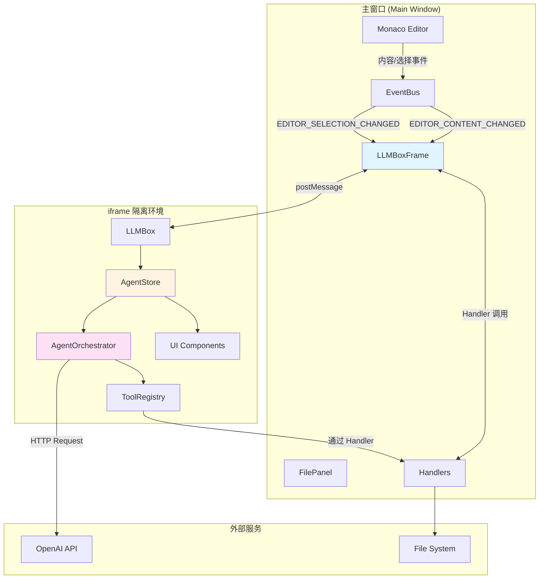
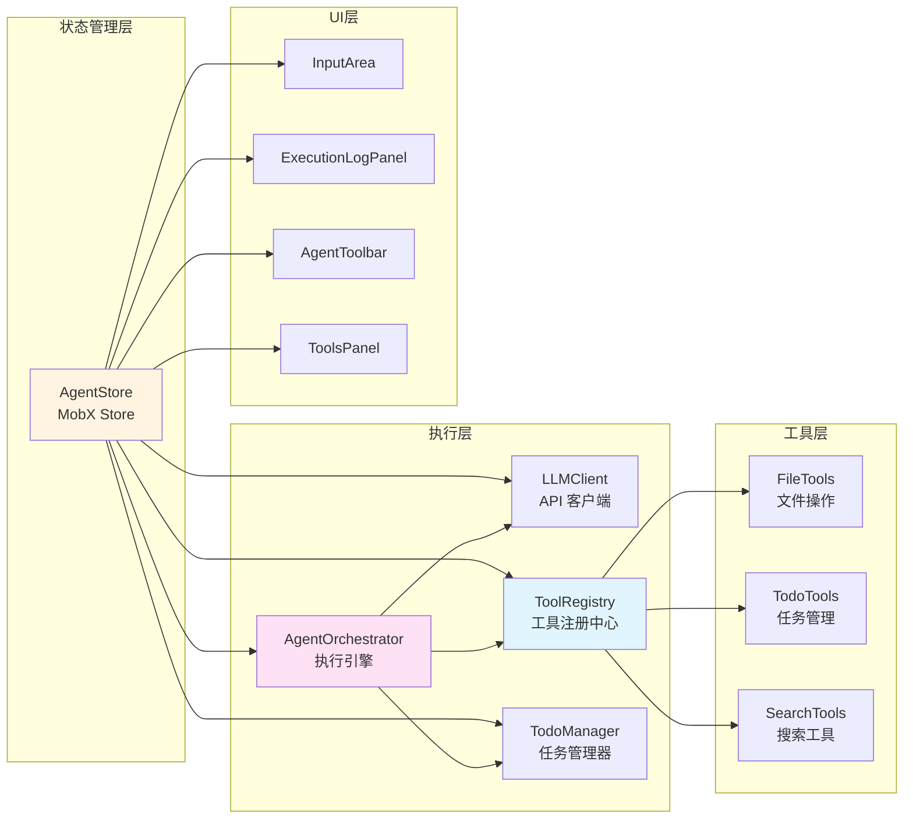
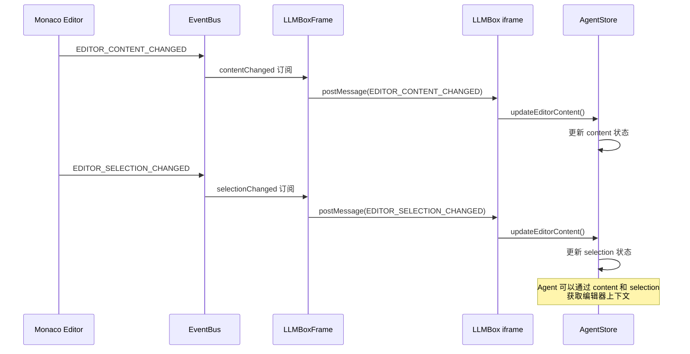
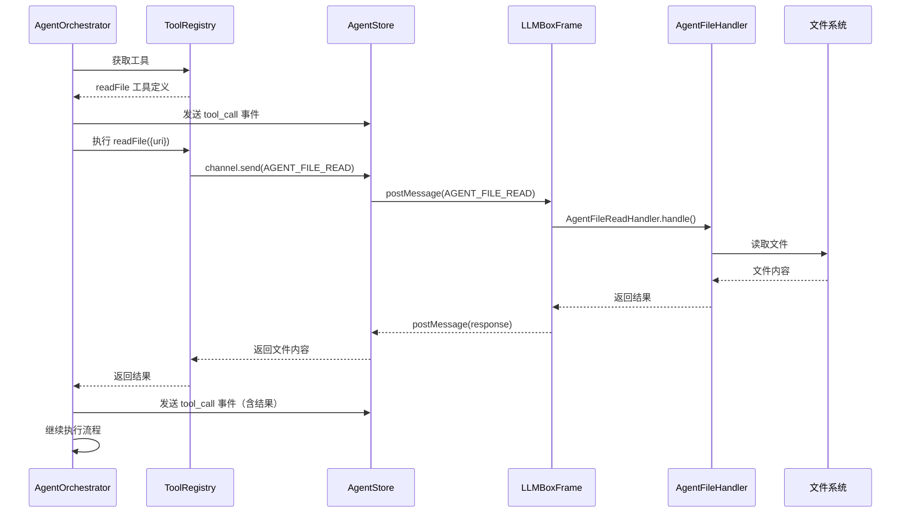

# LLMBox 架构文档

## 概述

LLMBox 是 ONote 笔记应用中的 AI Agent 功能模块，采用 iframe 隔离架构，通过消息传递实现主窗口和 AI 功能的通信。系统支持基于 OpenAI 兼容 API 的智能对话、文件操作和任务管理。

## 系统架构

### 架构层次图



### 核心模块关系



## 目录结构

```
packages/renderer/src/llmbox/
├── agent/                          # Agent 核心模块
│   ├── orchestrator.ts             # Agent 执行引擎
│   └── tools/                      # 工具集合
│       ├── registry.ts             # 工具注册中心
│       ├── file.ts                 # 文件操作工具
│       ├── search.ts               # 搜索工具
│       ├── todo.ts                 # 待办事项类型定义
│       └── todo-manager.ts         # 待办事项管理器
├── components/                     # UI 组件
│   ├── AgentActionButtons.tsx      # Agent 操作按钮
│   ├── AgentStatus.tsx             # Agent 状态显示
│   ├── AgentToolbar.tsx            # Agent 工具栏
│   ├── BottomTabs.tsx              # 底部标签页
│   ├── EmptyState.tsx              # 空状态组件
│   ├── ExecutionLogPanel.tsx       # 执行日志面板
│   └── ToolsPanel.tsx              # 工具面板
├── constants/                      # 常量定义
│   └── LLMBoxConstants.ts          # 消息类型常量
├── core/                           # 核心功能模块
│   ├── api/                        # API 相关
│   │   ├── client.ts               # LLM API 客户端
│   │   └── sse.ts                  # Server-Sent Events 处理
│   ├── config.ts                   # 配置定义
│   ├── index.ts                    # 核心模块导出
│   └── types/                      # 类型定义
│       └── index.ts                # 核心类型导出
├── ui/                             # UI 相关工具
│   └── hooks/                      # React Hooks
│       └── useAgent.ts             # Agent Hook
├── AgentPanel.tsx                  # Agent 主面板组件
├── AgentStore.ts                   # Agent 数据存储（MobX）
├── InputArea.tsx                   # 输入区域组件
├── LLMBox.tsx                      # LLMBox 主组件
├── types.ts                        # 兼容性类型定义
├── index.ts                        # 主入口导出
└── README.md                       # 本文档

packages/renderer/src/main/containers/LLMBox/
├── LLMBoxFrame.tsx                 # iframe 容器组件
└── handlers/                       # 消息处理器
    ├── BaseHandler.ts              # Handler 基类
    ├── HandlerRegistry.ts          # Handler 注册表
    ├── AgentFileHandler.ts         # 文件操作处理器
    ├── AgentContextHandler.ts      # 上下文持久化处理器
    ├── ConversationHandler.ts      # 对话历史处理器
    ├── EditorEventHandler.ts       # 编辑器事件处理器
    └── LLMConfigHandler.ts         # LLM 配置处理器
```

## 消息流程

### 用户输入到 Agent 执行流程

```mermaid
sequenceDiagram
    participant User as 用户
    participant Input as InputArea
    participant Store as AgentStore
    participant Orchestrator as AgentOrchestrator
    participant LLM as LLM API
    participant Tools as ToolRegistry
    participant Handlers as LLMBoxFrame Handlers
    participant FS as 文件系统

    User->>Input: 输入提示词
    Input->>Store: runAgent(prompt)
    Store->>Store: 构建消息历史
    Store->>Orchestrator: run(prompt, history)

    loop 迭代循环 (最多50次)
        Orchestrator->>LLM: 调用 API (streaming)
        LLM-->>Orchestrator: 流式返回内容
        Orchestrator->>Store: 发送 thinkingChunk 事件
        Store->>Input: 更新 UI

        alt LLM 返回工具调用
            Orchestrator->>Tools: 获取工具
            Tools-->>Orchestrator: 工具定义

            Orchestrator->>Handlers: 发送工具调用请求
            Handlers->>FS: 执行文件操作
            FS-->>Handlers: 返回结果
            Handlers-->>Orchestrator: 返回工具结果

            Orchestrator->>Store: 发送 step 事件
            Orchestrator->>Store: 发送 todoChange 事件
        else LLM 返回最终答案
            Orchestrator->>Store: 发送 final_answer 事件
            Orchestrator->>Store: 发送 done 事件
            break 退出循环
        end
    end

    Store->>Store: setRunning(false)
```

### 编辑器事件同步流程



### 文件操作流程



## 核心模块详解

### 1. AgentStore (MobX 状态管理)

**职责**: 管理 Agent 的所有状态，协调各模块间的通信

**状态字段**:
- `todos`: 待办事项列表
- `tools`: 可用工具列表
- `executionLog`: 执行日志
- `conversationHistory`: 对话历史
- `agentState`: Agent 当前状态 (idle/thinking/executing)
- `isRunning`: 是否正在运行
- `content/selection`: 编辑器内容和选择

**核心方法**:
- `runAgent()`: 启动 Agent 执行
- `stopAgent()`: 停止 Agent 执行
- `saveContext/loadContext()`: 上下文持久化
- `saveExecutionState/loadExecutionState()`: 执行状态管理
- `fetchLLMConfig()`: 获取 LLM 配置

**文件**: [AgentStore.ts](packages/renderer/src/llmbox/AgentStore.ts)

### 2. AgentOrchestrator (执行引擎)

**职责**: Agent 的核心执行逻辑，协调 LLM 调用和工具执行

**执行流程**:
1. 构建系统提示词
2. 调用 LLM 获取响应
3. 解析工具调用
4. 执行工具并收集结果
5. 判断是否继续执行

**事件系统**:
- `step`: 执行步骤事件
- `thinkingChunk`: 思考内容流式更新
- `stateChange`: 状态变更事件
- `message`: 消息事件
- `todoChange`: 待办事项变更事件
- `error`: 错误事件
- `done`: 完成事件

**文件**: [orchestrator.ts](packages/renderer/src/llmbox/agent/orchestrator.ts)

### 3. ToolRegistry (工具注册中心)

**职责**: 管理所有可用工具，生成 OpenAI Function Schema

**工具分类**:
- **文件操作工具**: readFile, writeFile, replaceFileContent, createFile, deleteFile, listFiles, searchFiles, searchInFile
- **待办事项工具**: addTodo, updateTodo, deleteTodo, listTodos
- **搜索工具**: (未来扩展)

**文件**: [registry.ts](packages/renderer/src/llmbox/agent/tools/registry.ts)

### 4. LLMClient (API 客户端)

**职责**: 封装 OpenAI API 调用，支持流式输出

**特性**:
- 使用 OpenAI SDK
- 支持自定义 base URL
- 流式输出回调
- 工具调用支持
- 错误处理

**文件**: [client.ts](packages/renderer/src/llmbox/core/api/client.ts)

### 5. LLMBoxFrame (iframe 容器)

**职责**: 主窗口中的 iframe 容器，建立双向通信信道，路由消息

**通信方式**: 使用 `bidc` 库的 `createChannel` 建立 postMessage 通信

**处理器**:
- AgentFileHandler: 文件操作（8 个工具）
- AgentContextHandler: 上下文持久化（3 个操作）
- ConversationHandler: 对话历史（2 个操作）
- EditorEventHandler: 编辑器事件（3 个操作）
- LLMConfigHandler: LLM 配置获取

**文件**: [LLMBoxFrame.tsx](packages/renderer/src/main/containers/LLMBox/LLMBoxFrame.tsx)

## 消息类型定义

所有消息类型在 [LLMBoxConstants.ts](packages/renderer/src/llmbox/constants/LLMBoxConstants.ts) 中定义：

### 编辑器事件
- `EDITOR_FILE_OPEN`: 文件打开
- `EDITOR_CONTENT_CHANGED`: 内容变化
- `EDITOR_SELECTION_CHANGED`: 选择变化

### 对话管理
- `LLM_CONVERSATION_LOAD`: 加载对话历史
- `LLM_CONVERSATION_SAVE`: 保存对话历史

### Agent 文件操作
- `AGENT_FILE_READ`: 读取文件
- `AGENT_FILE_WRITE`: 写入文件
- `AGENT_FILE_REPLACE`: 替换文件内容
- `AGENT_FILE_CREATE`: 创建文件
- `AGENT_FILE_DELETE`: 删除文件
- `AGENT_FILE_LIST`: 列出目录
- `AGENT_FILE_SEARCH`: 搜索文件
- `AGENT_FILE_SEARCH_IN`: 在文件中搜索

### Agent 状态管理
- `AGENT_GET_ROOT_URI`: 获取根 URI
- `AGENT_GET_ACTIVE_FILE_URI`: 获取活动文件 URI

### 上下文持久化
- `AGENT_CONTEXT_LOAD`: 加载上下文
- `AGENT_CONTEXT_SAVE`: 保存上下文

### 执行状态管理
- `AGENT_EXECUTION_STATE_LOAD`: 加载执行状态
- `AGENT_EXECUTION_STATE_SAVE`: 保存执行状态
- `AGENT_EXECUTION_STATE_DELETE`: 删除执行状态

### LLM 配置
- `LLM_CONFIG_GET`: 获取 LLM 配置

## 工具系统

### 工具接口定义

所有工具遵循统一的接口：

```typescript
interface Tool {
  name: string;
  description: string;
  parameters: ToolParameters;
  executor: (params: Record<string, unknown>) => Promise<unknown>;
  metadata?: {
    category: 'file' | 'search' | 'custom';
    permission: 'read' | 'write';
    dangerous?: boolean;
  };
}
```

### 文件操作工具

| 工具名 | 描述 | 权限 | 危险性 |
|--------|------|------|--------|
| readFile | 读取文件内容 | read | 安全 |
| writeFile | 写入文件内容 | write | ⚠️ 危险 |
| replaceFileContent | 替换文件内容 | write | ⚠️ 危险 |
| createFile | 创建新文件 | write | ⚠️ 危险 |
| deleteFile | 删除文件 | write | ⚠️ 危险 |
| listFiles | 列出目录内容 | read | 安全 |
| searchFiles | 搜索文件 | read | 安全 |
| searchInFile | 在文件中搜索 | read | 安全 |

### 待办事项工具

| 工具名 | 描述 |
|--------|------|
| addTodo | 添加待办事项 |
| updateTodo | 更新待办事项 |
| deleteTodo | 删除待办事项 |
| listTodos | 列出待办事项 |

## 配置和常量

### 默认配置

```typescript
const DEFAULT_CONFIG = {
  llm: {
    apiBase: 'https://api.openai.com/v1/chat/completions',
    model: 'gpt-4o',
    timeout: 60000,
  },
  agent: {
    maxIterations: 50,
    compressRatio: 0.3,
    contextWindow: 128000,
  },
};
```

### AgentConfig

```typescript
interface AgentConfig {
  apiKey: string;
  model: string;
  apiBase: string;
  fileUri?: string;
  rootUri?: string;
  maxIterations?: number;
  showThinking?: boolean;
  contextWindowSize?: number;
  compressRatio?: number;
}
```

## 安全特性

### 1. 进程隔离
- LLMBox 运行在独立的 iframe 中
- 使用严格的 Content Security Policy
- iframe 崩溃不影响主窗口

### 2. 权限控制
- 工具分为 read 和 write 权限
- 危险操作标记和警告
- 操作确认机制

### 3. 消息验证
- 所有消息通过类型验证
- 统一的错误处理
- 日志记录

## 已发现的代码问题

### 1. 硬编码消息类型 (AgentStore.ts)

**位置**:
- [AgentStore.ts:310](packages/renderer/src/llmbox/AgentStore.ts#L310)
- [AgentStore.ts:340](packages/renderer/src/llmbox/AgentStore.ts#L340)

**问题**:
```typescript
// 第 310 行
type: 'AGENT_CONTEXT_SAVE',  // 应该使用 LLM_BOX_MESSAGE_TYPES.AGENT_CONTEXT_SAVE

// 第 340 行
type: 'AGENT_CONTEXT_LOAD',  // 应该使用 LLM_BOX_MESSAGE_TYPES.AGENT_CONTEXT_LOAD
```

**影响**: 容易出错，不利于维护

**建议修复**:
```typescript
import { LLM_BOX_MESSAGE_TYPES } from './constants/LLMBoxConstants';

// 修改为
type: LLM_BOX_MESSAGE_TYPES.AGENT_CONTEXT_SAVE,
type: LLM_BOX_MESSAGE_TYPES.AGENT_CONTEXT_LOAD,
```

---

### 2. 类型断言不安全 (AgentStore.ts:245)

**位置**: [AgentStore.ts:245](packages/renderer/src/llmbox/AgentStore.ts#L245)

**问题**:
```typescript
timestamp: msg.timestamp instanceof Date
  ? msg.timestamp
  : new Date(msg.timestamp as unknown as string)  // 不安全的类型断言
```

**影响**: 类型安全性较弱，可能在运行时出错

**建议修复**:
```typescript
timestamp: msg.timestamp instanceof Date
  ? msg.timestamp
  : new Date(String(msg.timestamp))
```

---

### 3. HandlerRegistry 未使用

**位置**: [handlers/HandlerRegistry.ts](packages/renderer/src/main/containers/LLMBox/handlers/HandlerRegistry.ts)

**问题**:
- 存在 `HandlerRegistry.ts` 文件，但在 [LLMBoxFrame.tsx:54](packages/renderer/src/main/containers/LLMBox/LLMBoxFrame.tsx#L54) 中直接使用对象字面量注册 handlers
- 未利用已有的 HandlerRegistry 基础设施

**影响**: 代码重复，不利于统一管理

**建议修复**:
```typescript
// 使用 HandlerRegistry
import { HandlerRegistry } from './handlers/HandlerRegistry';

const handlerRegistry = new HandlerRegistry(stores, onote);
const handlers = handlerRegistry.getAllHandlers();
```

---

### 4. LLMConfigHandler 未添加到版本控制

**位置**: [handlers/LLMConfigHandler.ts](packages/renderer/src/main/containers/LLMBox/handlers/LLMConfigHandler.ts)

**问题**: 文件在 git status 中显示为未跟踪文件 (??)

**影响**: 可能导致团队协作时配置获取功能不一致

**建议修复**: 添加到 git 版本控制

---

### 5. 消息类型定义分散风险

**位置**: [LLMBoxConstants.ts](packages/renderer/src/llmbox/constants/LLMBoxConstants.ts)

**问题**: 消息类型在 `LLMBoxConstants.ts` 中定义，但部分代码中使用了硬编码字符串

**影响**: 可能导致消息类型不一致，难以维护

**建议**:
- 确保所有消息类型都从 `LLM_BOX_MESSAGE_TYPES` 导入
- 添加 ESLint 规则禁止硬编码消息类型字符串
- 定期检查代码中是否有硬编码的消息类型

---

### 6. 缺少错误边界处理

**位置**: [LLMBoxFrame.tsx:124-140](packages/renderer/src/main/containers/LLMBox/LLMBoxFrame.tsx#L124)

**问题**:
```typescript
receive(async ({ type, data }: any) => {
  const handler = handlers[type];
  if (!handler) {
    console.warn(`[LLMBoxFrame] No handler for type: ${type}`);
    return undefined;
  }

  try {
    const result = await handler.handle(data);
    return result;
  } catch (error) {
    console.error(`[LLMBoxFrame] Handler error for ${type}:`, error);
    return {
      error: error instanceof Error ? error.message : 'Unknown error',
    };
  }
});
```

**影响**: 虽然有错误处理，但未将错误反馈给 iframe，用户体验不佳

**建议**: 添加错误通知机制，让 iframe 能够显示错误信息

---

## 扩展指南

### 添加新工具

1. 在 `agent/tools/` 中创建工具文件
2. 实现工具的 `executor` 函数
3. 在 `ToolRegistry` 中注册工具
4. 在 `LLMBoxFrame` 中添加对应的 Handler（如果需要主进程处理）

### 添加新消息类型

1. 在 `constants/LLMBoxConstants.ts` 中添加消息类型
2. 在 `LLMBoxFrame` 中添加对应的 Handler
3. 更新本文档的消息类型列表

### 添加新 UI 组件

1. 在 `components/` 中创建组件文件
2. 使用 `observer` 包装组件以响应 MobX 状态变化
3. 在主组件中使用新组件

## 性能优化建议

1. **流式输出优化**: 已经实现了流式输出，可以减少首字节时间
2. **上下文压缩**: 当对话历史过长时，自动压缩旧消息
3. **工具调用优化**: 缓存文件读取结果，避免重复读取
4. **UI 虚拟化**: 执行日志面板可以考虑使用虚拟列表

## 未来改进方向

1. **多模型支持**: 支持更多 LLM 提供商（Anthropic、Google 等）
2. **工具市场**: 允许第三方开发者自定义工具
3. **对话模板**: 提供预定义的对话模板
4. **协作功能**: 支持多用户共享 Agent 上下文
5. **本地模型**: 支持 WebGPU 运行的本地模型

## 相关资源

- [OpenAI Function Calling 文档](https://platform.openai.com/docs/guides/function-calling)
- [MobX 文档](https://mobx.js.org/)
- [bidc 文档](https://www.npmjs.com/package/bidc)

---

## 架构设计评判（基于《UNIX编程艺术》原则）

本章节基于 Eric S. Raymond 的《UNIX编程艺术》中的设计原则，对 LLMBox 架构进行评判，为后续重构提供指导。

### 总体评分: ⭐⭐⭐⭐ (4/5)

**优点**: 模块化清晰、职责分离良好、安全性设计到位
**缺点**: 职责耦合、过度隔离、缺乏可测试性

---

### 1. 模块化原则 (Modularity)

**评分**: ⭐⭐⭐⭐☆ (4/5)

**符合点**:
- ✅ 清晰的模块边界：AgentStore、AgentOrchestrator、ToolRegistry 各司其职
- ✅ 工具系统模块化良好：每个工具都是独立的、可组合的
- ✅ 通信层通过 Channel 接口抽象，易于替换

**违反点**:
- ❌ **AgentStore 职责过重** (违反单一职责原则)
  ```typescript
  // AgentStore 承担了太多职责：
  // - 状态管理 (MobX)
  // - 业务逻辑 (runAgent, stopAgent)
  // - 上下文持久化 (saveContext, loadContext)
  // - 执行状态管理 (saveExecutionState, loadExecutionState)
  // - LLM 配置获取 (fetchLLMConfig)
  ```

  **建议重构**:
  ```typescript
  // 拆分为多个专职模块：
  AgentState        // 只负责状态
  AgentExecutor     // 负责执行逻辑
  ContextManager    // 负责上下文持久化
  ConfigManager     // 负责配置管理
  ```

- ❌ **LLMBoxFrame 混合了容器和路由职责**
  - 既是 React 容器组件
  - 又是消息路由器
  - 还是事件监听器

  **建议**: 将消息路由逻辑抽取为独立的 `MessageRouter` 类

**重构优先级**: 🔴 高

---

### 2. 清晰性原则 (Clarity)

**评分**: ⭐⭐⭐☆☆ (3/5)

**符合点**:
- ✅ 命名清晰：`AgentOrchestrator`、`ToolRegistry` 等名称表达明确
- ✅ 代码结构直观：目录组织符合直觉

**违反点**:
- ❌ **硬编码字符串** (违反"代码即文档"原则)
  ```typescript
  // AgentStore.ts:310, 340
  type: 'AGENT_CONTEXT_SAVE'  // 应该使用常量
  ```

- ❌ **类型断言** 降低清晰度
  ```typescript
  // AgentStore.ts:245
  new Date(msg.timestamp as unknown as string)  // 为什么要 as unknown?
  ```

- ❌ **双向通信缺乏类型安全**
  ```typescript
  // Channel 接口过于宽松
  interface Channel {
    send: (message: { type: string; data: unknown }) => Promise<Record<string, unknown>>;
  }
  ```
  **建议**: 使用泛型或 discriminated unions 提升类型安全

**重构优先级**: 🟡 中

---

### 3. 分离原则 (Separation)

**评分**: ⭐⭐⭐☆☆ (3/5)

**符合点**:
- ✅ 机制与策略分离：ToolRegistry 定义注册机制，具体工具由策略决定
- ✅ 接口与引擎分离：Channel 接口与 postMessage 实现分离

**违反点**:
- ❌ **策略与机制混淆**
  ```typescript
  // AgentOrchestrator 既包含执行机制，又包含策略：
  - shouldCompress()      // 机制
  - buildSystemPrompt()   // 策略（硬编码中文提示词）
  - shouldContinue()      // 策略（硬编码业务逻辑）
  ```

  **建议**: 将策略抽取为可配置的 `AgentStrategy` 接口

- ❌ **数据与视图耦合**
  ```typescript
  // ExecutionStep 包含了 UI 相关的 format 信息
  interface ExecutionStep {
    type: 'thinking' | 'tool_call' | 'final_answer';
    content: string;
    // 这些字段主要是为了 UI 显示，不是核心数据
    toolName?: string;
    toolParams?: Record<string, unknown>;
    toolResult?: unknown;
  }
  ```

**重构优先级**: 🟡 中

---

### 4. 简洁性原则 (Simplicity)

**评分**: ⭐⭐⭐☆☆ (3/5)

**符合点**:
- ✅ 工具系统简洁：统一的 Tool 接口，易于理解和使用
- ✅ 消息传递模型简单：request/response 模式

**违反点**:
- ❌ **过度抽象**
  ```typescript
  // HandlerRegistry 存在但未使用，增加了理解成本
  // 实际代码中直接用对象字面量
  const handlers: Record<string, any> = { ... }
  ```

- ❌ **不必要的间接层**
  ```
  Tool -> Channel -> LLMBoxFrame -> Handler -> FileSystem
  ```
  对于 iframe 环境，这个调用链过于复杂。

  **建议**: 考虑使用更直接的 IPC 机制，或者移除 iframe 隔离

- ❌ **双持久化机制冗余**
  ```typescript
  // AgentStore 中有两套持久化：
  saveContext/loadContext        // 上下文
  saveExecutionState/loadExecutionState  // 执行状态
  ```
  功能重叠，增加复杂度

**重构优先级**: 🟢 低（可先优化其他问题）

---

### 5. 透明性原则 (Transparency)

**评分**: ⭐⭐⭐⭐☆ (4/5)

**符合点**:
- ✅ 执行日志详细：ExecutionLogPanel 完整展示执行过程
- ✅ 事件系统可观测：7 种事件覆盖完整生命周期
- ✅ 错误处理有日志记录

**违反点**:
- ❌ **iframe 隔离降低了透明度**
  - 开发者需要同时调试两个窗口
  - postMessage 通信难以追踪
  - 错误堆栈跨窗口丢失信息

- ❌ **缺少调试模式**
  ```typescript
  // 建议添加：
  interface DebugConfig {
    logLevel: 'debug' | 'info' | 'warn' | 'error';
    showInternalSteps: boolean;
    verboseToolCalls: boolean;
  }
  ```

**重构优先级**: 🟢 低

---

### 6. 健壮性原则 (Robustness)

**评分**: ⭐⭐⭐☆☆ (3/5)

**符合点**:
- ✅ iframe 隔离：崩溃不影响主窗口
- ✅ 权限控制：工具权限分级
- ✅ 错误处理：try-catch 覆盖

**违反点**:
- ❌ **缺少容错机制**
  ```typescript
  // AgentOrchestrator 中工具调用失败会导致整个流程失败
  // 建议添加重试机制和降级策略
  ```

- ❌ **状态恢复不完善**
  ```typescript
  // resumeExecution() 只是简单继续，没有检查状态一致性
  // 如果环境变化（文件被删除、配置变更）会导致错误
  ```

- ❌ **缺少输入验证**
  ```typescript
  // Tool 的 executor 直接接收参数，没有 schema 验证
  executor: async (params: Record<string, unknown>) => Promise<unknown>
  // 应该在执行前验证参数
  ```

**重构优先级**: 🔴 高

---

### 7. 表示原则 (Representation)

**评分**: ⭐⭐⭐⭐☆ (4/5)

**符合点**:
- ✅ 配置即数据：AgentConfig 使用纯数据结构
- ✅ 工具定义即数据：OpenAI Function Schema 格式
- ✅ 执行日志即数据：ExecutionStep 可序列化

**违反点**:
- ❌ **状态分散**
  ```typescript
  // Agent 状态分散在多个地方：
  - AgentStore.isRunning
  - AgentStore.agentState
  - AgentOrchestrator.currentIteration
  - AgentOrchestrator.abortController
  ```

  **建议**: 统一状态表示，使用状态机模式

- ❌ **消息类型不统一**
  ```typescript
  // 有些消息在 LLMBoxConstants.ts 定义
  // 有些硬编码在代码中
  // 有些在 types.ts 中定义
  ```

**重构优先级**: 🟡 中

---

### 8. 最小意外原则 (Least Surprise)

**评分**: ⭐⭐⭐☆☆ (3/5)

**符合点**:
- ✅ 命名符合直觉：`readFile`、`writeFile` 等
- ✅ 行为可预测：工具调用返回期望的结果

**违反点**:
- ❌ **iframe 通信的意外行为**
  ```typescript
  // postMessage 是异步的，但 Channel 接口没有明确表达这一点
  // 开发者可能误以为是同步调用
  ```

- ❌ **状态更新时机不明确**
  ```typescript
  // MobX 的 runInAction 使用不一致
  // 有些地方用，有些地方不用
  // 导致状态更新时机难以预测
  ```

- ❌ **工具执行顺序不可控**
  ```typescript
  // LLM 可能同时调用多个工具
  // 但系统是串行执行的，可能不符合预期
  ```

**重构优先级**: 🟡 中

---

### 9. 沉默原则 (Silence)

**评分**: ⭐⭐⭐⭐☆ (4/5)

**符合点**:
- ✅ 正常情况下保持沉默
- ✅ 错误时有适当的日志
- ✅ 使用结构化日志

**违反点**:
- ❌ **过度日志**
  ```typescript
  // 某些日志级别不明确
  logger.info('Tools loaded', { count: tools.length });  // 应该是 debug
  ```

- ❌ **控制台警告过多**
  ```typescript
  console.warn(`[LLMBoxFrame] No handler for type: ${type}`);
  // 应该使用日志系统，而不是直接 console.warn
  ```

**重构优先级**: 🟢 低

---

### 10. 可扩展性原则 (Extensibility)

**评分**: ⭐⭐⭐⭐☆ (4/5)

**符合点**:
- ✅ 工具系统易扩展：实现 Tool 接口即可
- ✅ 事件系统易扩展：订阅任意事件
- ✅ Handler 系统易扩展：继承 BaseHandler

**违反点**:
- ❌ **硬编码的策略难以扩展**
  ```typescript
  // buildSystemPrompt() 硬编码了中文提示词
  // 无法支持多语言或自定义提示词模板
  ```

- ❌ **缺乏插件机制**
  ```typescript
  // 当前只能通过修改代码来添加工具
  // 建议支持动态插件加载
  ```

**重构优先级**: 🟢 低

---

### 11. 可测试性 (Testability) **[补充原则]**

**评分**: ⭐⭐☆☆☆ (2/5)

**违反点**:
- ❌ **AgentStore 难以测试**
  - 依赖太多外部模块
  - 没有依赖注入
  - 状态管理逻辑与业务逻辑耦合

- ❌ **工具执行难以测试**
  ```typescript
  // 工具通过 Channel 调用主进程
  // 在单元测试中难以模拟
  // 建议引入依赖注入和 Mock 接口
  ```

- ❌ **缺少测试文件**
  - `__tests__` 目录为空
  - 没有单元测试、集成测试

**重构优先级**: 🔴 高

---

### 12. 性能原则 (Performance) **[补充原则]**

**评分**: ⭐⭐⭐☆☆ (3/5)

**违反点**:
- ❌ **iframe 通信开销**
  - 每次 Tool 调用都需要 postMessage
  - 数据序列化/反序列化开销
  - 建议批量操作或本地缓存

- ❌ **流式输出可能有性能问题**
  ```typescript
  // 每次触发 onChunk 都会更新 UI
  // 高频调用可能导致卡顿
  onChunk: (chunk, isFirst) => {
    this.thinkingContent += chunk;
    this.emit('thinkingChunk', { stepId, content: this.thinkingContent, isFirst });
  }
  ```
  **建议**: 添加节流 (throttle) 或防抖 (debounce)

**重构优先级**: 🟡 中

---

## 重构路线图

基于以上分析，建议按以下优先级进行重构：

### 🔴 高优先级（立即行动）

1. **拆分 AgentStore**
   - 创建 `AgentStateManager`：只负责状态管理
   - 创建 `AgentExecutor`：负责执行逻辑
   - 创建 `ContextManager`：负责持久化
   - 创建 `ConfigManager`：负责配置管理

2. **添加输入验证**
   - 工具参数验证（使用 zod 或类似库）
   - 消息类型验证（使用运行时类型检查）
   - 配置验证

3. **提升可测试性**
   - 引入依赖注入
   - 创建 Mock 接口
   - 添加单元测试（目标覆盖率 70%+）

### 🟡 中优先级（近期规划）

4. **移除硬编码**
   - 使用常量替代硬编码字符串
   - 抽取策略为可配置接口
   - 支持多语言提示词模板

5. **统一状态管理**
   - 使用状态机模式
   - 统一状态表示
   - 改进状态恢复机制

6. **提升类型安全**
   - 使用 discriminated unions 优化 Channel 接口
   - 移除不安全的类型断言
   - 添加严格的 TypeScript 配置

### 🟢 低优先级（长期优化）

7. **简化架构**
   - 评估 iframe 隔离的必要性
   - 减少不必要的间接层
   - 合并冗余的持久化机制

8. **性能优化**
   - 添加流式输出节流
   - 实现工具调用缓存
   - UI 虚拟化

9. **增强可观测性**
   - 添加调试模式
   - 改进日志系统
   - 添加性能监控

---

## 具体重构建议

### 示例 1: 拆分 AgentStore

**重构前**:
```typescript
class AgentStore {
  // 600+ 行代码，职责过多
  runAgent() { ... }
  stopAgent() { ... }
  saveContext() { ... }
  loadContext() { ... }
  fetchLLMConfig() { ... }
  // ... 更多方法
}
```

**重构后**:
```typescript
// 只负责状态
class AgentState {
  todos: TodoItem[] = [];
  executionLog: ExecutionStep[] = [];
  conversationHistory: AgentMessage[] = [];
  agentState: 'idle' | 'thinking' | 'executing' = 'idle';
}

// 负责执行逻辑
class AgentExecutor {
  constructor(
    private state: AgentState,
    private orchestrator: AgentOrchestrator,
    private configManager: ConfigManager
  ) {}

  async run(prompt: string) { ... }
  stop() { ... }
}

// 负责持久化
class ContextManager {
  async save(fileUri: string, state: AgentState) { ... }
  async load(fileUri: string): Promise<AgentState> { ... }
}

// 负责配置
class ConfigManager {
  async fetchLLMConfig(): Promise<LLMConfig> { ... }
}

// 组合使用
class AgentStore {
  private state = new AgentState();
  private executor: AgentExecutor;
  private contextManager: ContextManager;
  private configManager: ConfigManager;
}
```

### 示例 2: 添加输入验证

**重构前**:
```typescript
executor: async (params: Record<string, unknown>) => {
  const response = await channel.send({ type: 'AGENT_FILE_READ', data: params });
  // 没有验证 params
}
```

**重构后**:
```typescript
import { z } from 'zod';

const readFileSchema = z.object({
  uri: z.string().url(),
});

executor: async (params) => {
  // 验证参数
  const validated = readFileSchema.parse(params);
  const response = await channel.send({
    type: 'AGENT_FILE_READ',
    data: validated
  });
}
```

### 示例 3: 提升类型安全

**重构前**:
```typescript
interface Channel {
  send: (message: { type: string; data: unknown }) => Promise<Record<string, unknown>>;
}
```

**重构后**:
```typescript
// 定义消息类型
type AgentFileReadMessage = {
  type: 'AGENT_FILE_READ';
  data: { uri: string };
};

type AgentFileWriteMessage = {
  type: 'AGENT_FILE_WRITE';
  data: { uri: string; content: string };
};

// 使用 discriminated unions
type AgentMessage = AgentFileReadMessage | AgentFileWriteMessage | ...;

interface Channel {
  send<T extends AgentMessage>(message: T): Promise<MessageResponse<T>>;
}
```

---

## 总结

LLMBox 架构在模块化和职责分离方面做得不错，但在以下方面需要改进：

1. **🔴 关键问题**：AgentStore 职责过重、缺乏输入验证、可测试性差
2. **🟡 重要问题**：硬编码、类型安全、状态管理分散
3. **🟢 次要问题**：性能优化、日志系统、可观测性

**建议**：优先解决高优先级问题，特别是拆分 AgentStore 和添加输入验证，这将显著提升代码质量和可维护性。

---

**文档版本**: 1.1
**最后更新**: 2026-01-14
**维护者**: ONote Team
